# VOLTIX — Master Product Document

| Field                   | Value                                                                                        |
| ----------------------- | -------------------------------------------------------------------------------------------- |
| **Product name**        | **Voltix**                                                                                   |
| **Team**                | Code Huntrix                                                                                 |
| **Problem code**        | SIH26219                                                                                     |
| **Theme**               | Smart Automation                                                                             |
| **Category**            | Hardware                                                                                     |
| **Document type**       | End-to-end product master specification                                                      |
| **Audience**            | Judges, investors, partners, internal product and engineering                                |
| **Status**              | Product specification — V1 architecture locked; field dataset and model training in progress |
| **Version**             | 1.0 Master                                                                                   |
| **Prior names**         | ShopBeat / SHOPBEAT / Voltify (same SIH line). Residential Voltify is **out of scope**.      |
| **Sensing stance (V1)** | CT-first; estimated kW from nominal V + assumed PF                                           |
| **Intelligence stance** | Hybrid edge + cloud; layered decision engines                                                |

---

## Table of contents

0. [Cover metadata](#0-cover-metadata--document-contract)
1. [Executive summary](#1-executive-summary)
2. [Vision and product definition](#2-vision-and-product-definition)
3. [Problem statement](#3-problem-statement)
4. [Solution overview](#4-solution-overview)
5. [Customer and jobs-to-be-done](#5-customer-and-jobs-to-be-done)
6. [End-to-end architecture](#6-end-to-end-architecture)
7. [Hardware system](#7-hardware-system)
8. [Software / intelligence platform overview](#8-software--intelligence-platform-overview)
9. [Layer 0 — Ingest](#9-layer-0--ingest)
10. [Layer 1 — Pulse](#10-layer-1--pulse)
11. [Layer 2 — Energy residual](#11-layer-2--energy-residual)
12. [Layer 3 — Condition / drift](#12-layer-3--condition--drift)
13. [Layer 4 — Ranker](#13-layer-4--ranker)
14. [Layer 5 — Alerts](#14-layer-5--alerts)
15. [Layer 6 — Action / AutoCut](#15-layer-6--action--autocut)
16. [Layer 7 — M&V](#16-layer-7--mv)
17. [Layer 8 — Applications UX](#17-layer-8--applications-ux)
18. [Data model and contracts](#18-data-model--contracts)
19. [Literature review and prior art](#19-literature-review--prior-art)
20. [Differentiation and competitive position](#20-differentiation--competitive-position)
21. [Safety, liability, compliance path](#21-safety-liability-compliance-path)
22. [Business model and GTM](#22-business-model--gtm)
23. [Deployment and commissioning](#23-deployment--commissioning)
24. [Roadmap V1→V2→V3](#24-roadmap-v1v2v3)
25. [Team capability map](#25-team-capability-map)
26. [Risks and mitigations](#26-risks-and-mitigations)
27. [Judge / investor FAQ](#27-judgeinvestor-faq)
28. [Glossary](#28-glossary)
29. [Appendices](#29-appendices)
    30?44. [Part II ? Extended product depth](#part-ii--extended-product-depth-50-page-completeness) (problem/solution depth, Condition doctrine, hardware BOM, scenarios, literature essays, data programme, UX, GTM, SIH mapping, claims card)

---

## 0. Cover metadata & document contract

### 0.1 Purpose of this document

This is the **single master description** of what Voltix is, why it exists, how it works end to end, and what each product layer does. It is written at **final product** level — not as a hackathon demo script, not as a residential energy app pitch, and not as a code dump.

It synthesizes:

- SIH problem framing and the ShopBeat / FINAL product thesis
- Hardware sensing and shop-floor survival constraints
- Technical due-diligence architecture: **Sense → Verify → Decide → Act → Prove**
- Locked engineering decisions: CT-first sensing, hybrid edge + cloud, Pulse + Energy + **Condition** + Ranker + Alerts + AutoCut + M&V
- Honest capability boundaries (what we claim vs what we do not)

### 0.2 How to read this document

| Reader                 | Start here        | Then read          |
| ---------------------- | ----------------- | ------------------ |
| SIH judge              | Section 1, 20, 27 | Sections 7, 12, 16 |
| Investor / partner     | Sections 1, 5, 22 | Sections 26, 24    |
| Hardware evaluator     | Sections 7, 21    | Section 15         |
| Intelligence evaluator | Sections 8–16     | Sections 19, 18    |
| Installer / operator   | Sections 23, 17   | Appendices A–D     |

### 0.3 Naming and scope lock

| Term                        | Status                                                           |
| --------------------------- | ---------------------------------------------------------------- |
| **Voltix**                  | Official product name for this SIH / MSME industrial line        |
| ShopBeat / SHOPBEAT         | Prior working names; same product thesis                         |
| Voltify                     | Prior / parallel naming; **residential Voltify is out of scope** |
| SIH26219                    | Problem statement identifier                                     |
| Code Huntrix                | Team                                                             |
| Smart Automation · Hardware | Theme and category                                               |

### 0.4 Product one-liner (locked)

**Voltix** is a low-cost retrofit **measurement + decision + proof layer** for legacy MSME factories that continuously observes per-machine energy behaviour, detects avoidable waste, ranks losses in rupees, optionally stops waste on **approved safe loads**, flags electrical **condition drift**, and exports **verifiable M&V evidence** so owners (and schemes) can prove savings.

### 0.5 Non-goals for this document

- Implementation source code, firmware listings, or API OpenAPI dumps
- Residential consumer energy coaching
- Claiming billing-grade utility metering accuracy in V1
- Claiming full predictive maintenance / RUL prophecy in V1

---

## 1. Executive summary

### 1.1 The gap in one paragraph

Indian engineering MSMEs pay large electricity bills with almost no **machine-level accountability**. Compressors unload into leaks, motors idle between jobs, furnaces and CNC cannot be blindly shut, and one-time audits do not enforce daily behaviour. Enterprise IoT assumes PLCs and IT teams. Cheap meters show numbers without prioritization, safe intervention, condition awareness, or proof. **Voltix closes that gap** as a brownfield retrofit stack priced for shops with 15–100 workers and roughly Rs 1–5 lakh monthly electricity spend.

### 1.2 What Voltix delivers

1. **Sense** — Clip-on CT nodes on prioritized feeders; local OLED trust; optional relay only on eligible loads.
2. **Verify** — Pulse states (`OFF | ACTIVE | IDLE | WASTE`) plus energy residual estimates of avoidable kW and rupees.
3. **Decide** — Rupee Waste Ranker and policy rules tell the owner what matters first.
4. **Act** — Alerts by default; AutoCut only when eligibility, whitelist, debounce, and fail-safe hardware allow it.
5. **Prove** — M&V baseline vs intervention windows export savings evidence.

Alongside waste, **Condition / drift** is a first-class layer: while a machine is ACTIVE, Voltix compares electrical behaviour to that machine’s own baseline and flags deterioration cues — without pretending to be a full PdM suite.

### 1.3 Architecture in one diagram

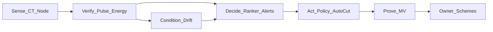

### 1.4 Commercial shape (order of magnitude)

| Line                                        | Indicative                                     |
| ------------------------------------------- | ---------------------------------------------- |
| Starter kit (gateway + 3–5 nodes + install) | ~Rs 25,000–35,000                              |
| Platform subscription                       | ~Rs 999 / month                                |
| AutoCut module                              | Hardware + policy enablement per eligible load |
| Expansion nodes                             | After first savings proof                      |
| AMC                                         | Calibration / health checks                    |

### 1.5 Differentiation in one sentence

Voltix is **not** another CT dashboard and **not** blind auto-cut. It is the MSME-priced combination of **per-machine waste visibility + rupee ranking + policy-gated intervention + condition drift flags + built-in M&V proof** for **legacy shops without PLC**.

### 1.6 Honest limits (executive)

V1 uses **estimated** power (CT + nominal V + assumed PF). AutoCut is **not** for furnaces or CNC mid-cycle class loads. Condition is **drift flagging**, not failure-day prediction. M&V is operational evidence, not a certified utility meter substitute unless later certified.

### 1.7 Why judges and investors should care

- **Category fit:** Hardware + Smart Automation with a real floor product, not slideware.
- **Problem fit:** SIH26219 maps to invisible spend, idle waste, weak enforcement, weak proof.
- **Moat:** The closed loop Sense to Prove plus Condition as a peer layer, not a bolted-on alert.
- **GTM:** Cluster selling, BEE auditors, OEMs, DISCOM-adjacent channels.

---

## 2. Vision and product definition

### 2.1 Vision

Every legacy MSME shop should know, every day:

1. What each major machine is **doing**
2. What is **normal** for that machine
3. What is **wasting** money right now
4. What is **deteriorating** electrically
5. **What to do** — and whether action was safe and proven

Voltix exists so that energy management is not a once-a-year PDF, but a continuous operating system for shop electricity behaviour.

### 2.2 Product definition

**Voltix** is a **retrofit industrial energy-waste intervention and condition-awareness platform** comprising:

| Layer        | Product object                                                                  |
| ------------ | ------------------------------------------------------------------------------- |
| Hardware     | Per-machine sensing nodes + shop gateway (+ optional actuation hardware)        |
| Intelligence | Layered engines: Ingest, Pulse, Energy, Condition, Ranker, Alerts, AutoCut, M&V |
| Applications | Web ops console + mobile owner/floor app                                        |
| Services     | Commissioning, tariff/config, AMC, expansion                                    |

### 2.3 Product principles

1. **Brownfield first** — No PLC required; clip-on CT; minimal machine control rewiring.
2. **Safety over cleverness** — Cloud loss never forces a cut; NC fail-safe power-on policy; never-AUTO list.
3. **Explainable decisions** — Ranker and alerts are rules-first so owners trust rupee recommendations.
4. **Proof is the product** — Without M&V, MSME schemes and owner belief collapse.
5. **Condition is first-class** — Drift is not a dashboard widget; it is Layer 3 with its own model path.
6. **Pareto installs** — Instrument top waste sources first; expand after proof.
7. **Honest physics** — CT-first V1 estimates power; do not market as billing-grade.

### 2.4 What Voltix is — and is not

| Voltix is                                                                  | Voltix is not                              |
| -------------------------------------------------------------------------- | ------------------------------------------ |
| An autonomous energy-waste intervention + proof layer for brownfield MSMEs | A generic residential bill app             |
| A measurement to decision to action to proof product                       | Just a dashboard for CT data               |
| Retrofit on legacy machines without PLC                                    | A Siemens / SCADA replacement              |
| Policy-gated AutoCut on eligible loads only                                | Blind auto-shutdown of production machines |
| CT-first estimated power + state + drift flags                             | Billing-grade utility metering             |
| Condition drift flagging from electrical baseline                          | Full predictive maintenance / RUL prophecy |

### 2.5 Reframe table (memorise)

| Weak framing              | Correct framing                                                                          |
| ------------------------- | ---------------------------------------------------------------------------------------- |
| We auto-cut idle machines | We are the measurement + prioritization + proof layer that makes MSME energy action work |
| AutoCut = the product     | AutoCut = optional enforcement on approved loads                                         |
| Dashboard = the value     | Ranked rupee waste + M&V export = the moat                                               |
| AI black box = trust      | Explainable Pulse then Residual then Ranker then Policy                                  |
| PdM claims win SIH        | Honest drift flags + waste rupee proof win trust                                         |

### 2.6 Five questions the product must answer daily

| #   | Question                                           | Primary layer                       |
| --- | -------------------------------------------------- | ----------------------------------- |
| 1   | What is the machine **doing**?                     | Pulse                               |
| 2   | What is **normal** for this machine in this state? | Pulse + baselines                   |
| 3   | What is **wasting**?                               | Energy residual + Ranker            |
| 4   | What is **deteriorating**?                         | Condition / drift                   |
| 5   | **What should we do?**                             | Alerts + AutoCut eligibility + Apps |

### 2.7 Operating loop

```text
SENSE → VERIFY → DECIDE → ACT → PROVE
   ↑__________________________________|
```

Every product feature must map to at least one step of this loop. Features that only decorate a dashboard without advancing Sense to Prove are out of scope for V1 priority.

---

## 3. Problem statement

### 3.1 High-level problem

Indian manufacturing MSMEs produce a large share of manufacturing output and consume a large share of industrial electricity, yet most **legacy shops** still operate with a structural energy management failure:

1. **Invisible per-machine spend** — One monthly bill; no machine-level accountability.
2. **Furnace and process heat intensity** — High loads where blind automation is unsafe; waste is real but action must be human-gated.
3. **Compressed air systems** — Generate-leak-unload cycles hide waste behind “the compressor is on.”
4. **Motors and auxiliaries** — Fans, pumps, conveyors run through breaks and between jobs.
5. **Idle / unloaded running** — Powered machines look “working” while producing no useful output.
6. **Power quality and demand** — Peaky behaviour and poor awareness of demand charges without continuous observation.
7. **No accountability culture** — Operators are not scored on idle kWh; supervisors lack a daily ranked list.
8. **No in-house energy talent** — Shops cannot hire SCADA engineers or maintain enterprise IoT.

The result: energy cost is felt as **bill shock**, not as a **daily actionable list**. Audits create PDFs; behaviour does not change.

### 3.2 Low-level operational problem

On a typical auto-component / machining floor (15–100 workers, Rs 1–5L/month electricity):

- A **compressor** cycles load/unload; unload or leak-driven run looks “on” but produces little useful air.
- A **mill / lathe** sits powered between jobs with spindle auxiliaries drawing standby current.
- A **press** waits between strokes with control and hydraulic auxiliaries live.
- A **motor / blower** runs through tea breaks and shift gaps.
- A **furnace-adjacent auxiliary** may be safe to monitor but unsafe to AutoCut.

The owner cannot answer:

- Is this draw **ACTIVE work**, **IDLE standby**, or **WASTE**?
- Which machine burned the most **avoidable rupees yesterday**?
- Did intervention **actually** reduce kWh vs baseline?
- Is ACTIVE current **drifting** from the machine’s normal band (early condition cue)?

Without continuous electrical observation + decision logic + proof, the shop cannot close the loop.

### 3.3 MSME problem stack

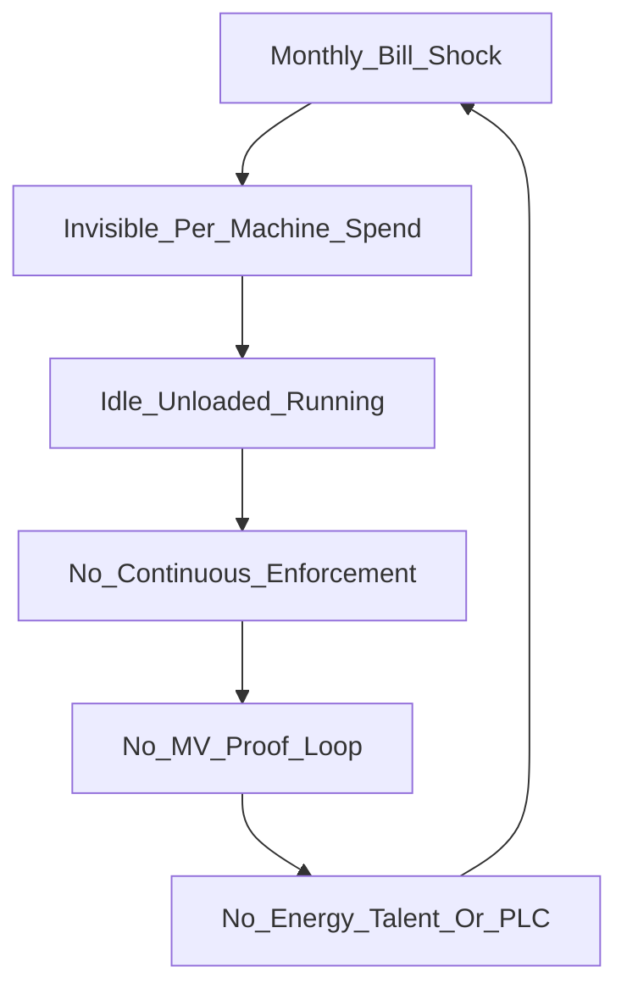

### 3.4 Why existing approaches fail MSMEs

| Approach                       | What it promises             | Failure mode for target MSME                       |
| ------------------------------ | ---------------------------- | -------------------------------------------------- |
| One-time energy audit          | Expert recommendations       | Report then shelf then no continuous action        |
| Enterprise IoT / SCADA         | Full visibility and control  | Cost, PLC dependency, IT integration burden        |
| Cheap kWh meters               | Numbers on a screen          | No prioritization, no enforcement, no proof export |
| Motor / VFD replacement alone  | Efficiency upgrade           | Capex without knowing which load to fix first      |
| OEM idle-cut features          | Machine-native standby logic | Fragmented across brands; not shop-wide; no M&V    |
| Government schemes / subsidies | Capital support              | Funds exist; MSMEs struggle to prove savings       |
| Generic AI energy dashboards   | Fancy charts                 | Weak shop-floor safety model; weak AutoCut policy  |

**Root gap:** continuous measurement + rupee prioritization + safe intervention + verifiable proof — at MSME price — for **legacy machines without PLC**.

### 3.5 Sector evidence (cited-style, directional)

Public and institutional narratives around Indian MSME energy repeatedly surface the same structural issues Voltix addresses. Exact percentages belong in slides with primary sources; the directional evidence base includes:

- **BEE / energy efficiency programmes** — Continuous monitoring and post-audit follow-through remain weak in many MSME clusters.
- **SAMEEEKSHA / cluster studies** — Sectoral energy intensity and technology gaps in foundries, forging, machining, textiles, and related sectors.
- **CEEW / TERI / World Bank FEEMP-style findings** — Capital and information barriers; compressed-air and motor systems as dominant waste categories; idle/unloaded operation as a known under-enforced loss mode.
- **Scheme / subsidy pathways** — Increasing expectation of measurement and verification style evidence for claimed savings.

Voltix does not invent the problem; it productizes a response that matches how MSMEs actually buy and operate.

### 3.6 Economic intuition

Consider a shop with Rs 2.5L/month electricity. If 8–15% of consumption is avoidable idle/unloaded behaviour on a handful of machines, that is tens of thousands of rupees per month — enough to pay for a starter kit and subscription many times over **if** the shop can see, prioritize, act, and prove. The barrier is not that MSMEs do not care about money; it is that they lack an operating system for electricity behaviour.

### 3.7 Problem statement for SIH26219

**Problem:** Legacy MSME factories lack an affordable, safe, continuous system to detect per-machine energy waste, prioritize interventions in rupees, optionally enforce on eligible loads, flag early electrical condition drift, and prove savings — without requiring PLC or enterprise IT.

**Impact if unsolved:** Persistent avoidable energy cost, weak scheme uptake, and zero accountability between bill cycles.

---

## 4. Solution overview

### 4.1 High-level solution

Voltix installs a **clip-on sensing node per prioritized machine**, aggregates data through a **shop gateway**, and runs a **decision stack** in software:

```text
SENSE → VERIFY → DECIDE → ACT → PROVE
```

| Step       | Meaning                                                                                            |
| ---------- | -------------------------------------------------------------------------------------------------- |
| **Sense**  | CT and supporting sensors read machine electrical behaviour without rewiring machine control logic |
| **Verify** | Pulse / energy logic confirms operating state and waste with confidence                            |
| **Decide** | Ranker + eligibility + policy decide what matters and whether action is allowed                    |
| **Act**    | Alert the owner — or AutoCut only on approved safe loads                                           |
| **Prove**  | M&V baseline vs intervention then exportable rupee / kWh evidence                                  |

### 4.2 Low-level solution (what happens to one amp reading)

1. Split-core CT measures line current on one feeder.
2. Node computes RMS current and an **estimated** kW using configured nominal voltage and assumed power factor (CT-first V1).
3. Optional enclosure temperature (DHT11) supports node/environment context.
4. Packets reach the shop gateway (MQTT), buffer locally if needed, then the Voltix platform.
5. **Ingest** validates, authenticates, and stores time series.
6. **Pulse** maps the signal to `OFF | ACTIVE | IDLE | WASTE` (rules-v1 then GMM-v1).
7. **Energy residual** estimates avoidable waste power while idle/waste-like.
8. **Condition** (ACTIVE only) compares against that machine’s electrical baseline then drift flag (Isolation Forest / baseline class).
9. **Ranker** orders machines by rupee impact (explainable rules).
10. **Alerts** interrupt on sustained waste, offline nodes, or drift.
11. **AutoCut policy** may suggest or execute cut on eligible loads only.
12. **M&V** attributes savings to the intervention window.
13. **Apps** show ranked rupees, alerts, approvals, and proof exports.

### 4.3 Solution modules

| Module                        | Role                                       |
| ----------------------------- | ------------------------------------------ |
| **Voltix Node**               | Sense, local compute, OLED, optional relay |
| **Pulse**                     | OFF/ACTIVE/IDLE/WASTE via rules then GMM   |
| **Energy residual**           | Avoidable kW / kWh / rupees                |
| **Condition**                 | ACTIVE drift / anomaly flags               |
| **Ranker**                    | Rupee priority list                        |
| **Adaptive Action / AutoCut** | Policy-gated actuation                     |
| **M&V**                       | Baseline vs intervention proof             |
| **Gateway**                   | MQTT + buffer + uplink                     |
| **Apps**                      | Web + mobile                               |

### 4.4 Solution principles mapped to constraints

| Constraint              | Solution response                                |
| ----------------------- | ------------------------------------------------ |
| No PLC                  | CT clamp + Wi-Fi node                            |
| Flaky internet          | Pi gateway local buffer                          |
| Safety fear of auto-cut | ALERT-ONLY default; AUTO whitelist; fail-safe ON |
| Owner attention scarce  | Ranker + severity/cooldown alerts                |
| Scheme proof needed     | Native M&V export                                |
| Limited talent          | Explainable UI; commissioning playbook           |

### 4.5 Hybrid edge + cloud

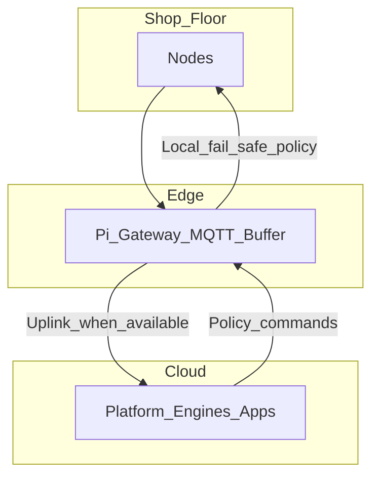

- Edge survives MSME internet outages for buffering and safety-local behaviour.
- Cloud provides multi-site history, auth, heavy analytics, M&V archives, apps.
- Safety-critical defaults live at hardware + local policy — not hope the cloud is up.

---

## 5. Customer and jobs-to-be-done

### 5.1 Ideal customer profile

| Attribute        | Definition                                                                                     |
| ---------------- | ---------------------------------------------------------------------------------------------- |
| Who              | Engineering MSMEs — auto components, machining, pump/CNC-adjacent shops, similar legacy floors |
| Size             | ~15–100 workers; roughly 8–25 major electrical loads                                           |
| Bill             | ~Rs 1–5 lakh / month electricity                                                               |
| Profile          | Legacy machines, little/no PLC, no dedicated energy manager                                    |
| Buyer            | Owner / partner / works manager                                                                |
| Influencer       | BEE auditor, cluster association, trusted OEM dealer                                           |
| Not targeting V1 | Large plants already on Siemens / iFactory / full SCADA; pure residential                      |

### 5.2 Jobs-to-be-done

| Job                             | Success looks like                                |
| ------------------------------- | ------------------------------------------------- |
| See where money burns           | Daily ranked rupee waste by machine               |
| Stop obvious idle waste safely  | Alerts + optional AutoCut on approved loads       |
| Trust the system                | OLED local numbers match app; fail-safe behaviour |
| Prove savings                   | Exportable baseline vs post-action report         |
| Catch early electrical oddities | Drift flag while ACTIVE then inspect              |
| Expand without re-architecture  | Add nodes after proof                             |

### 5.3 Buyer psychology

- Trust first, automation second. Owners fear production stoppage more than they love AI.
- Rupee language beats kWh language. Ranker must speak money.
- Proof unlocks expansion. Second purchase follows first M&V report.
- Cluster peer pressure works. Neighbour shop success beats cold ads.

### 5.4 Starter deployment philosophy

Pareto — instrument the top waste sources first (for example compressor + 2–4 other loads), not every socket on day one. Learn states for 1–2 weeks. Show first ranked waste. Optionally enable AutoCut on one eligible load. Export first M&V. Then expand.

### 5.5 Personas

| Persona       | Need                       | Voltix surface                |
| ------------- | -------------------------- | ----------------------------- |
| Owner         | Rupees and proof           | Mobile + M&V export           |
| Works manager | Daily action list          | Web ranker + alerts           |
| Electrician   | Safe install, local status | OLED, commissioning checklist |
| Auditor       | Evidence                   | M&V export                    |
| Operator      | Do not break my job        | Override, never-AUTO clarity  |

---

## 6. End-to-end architecture

### 6.1 System context

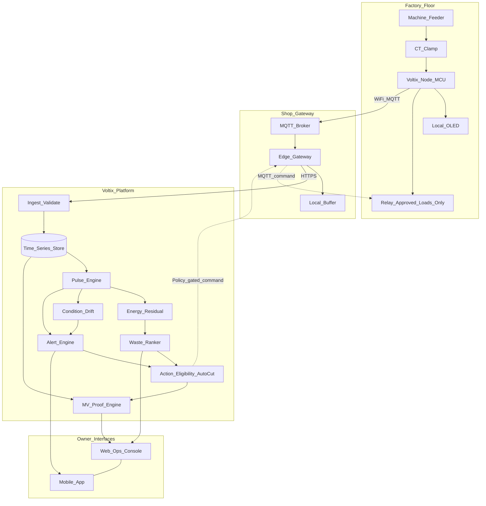

### 6.2 Design principles

1. Sensing and local fail-safe behaviour must not depend on cloud availability for safety.
2. Cloud loss must not force a cut. Relay defaults to power available.
3. Intelligence is layered; no single model owns the product.
4. Attribution is per-machine via dedicated CT.
5. Commands are policy-gated end to end.

### 6.3 Logical pipeline

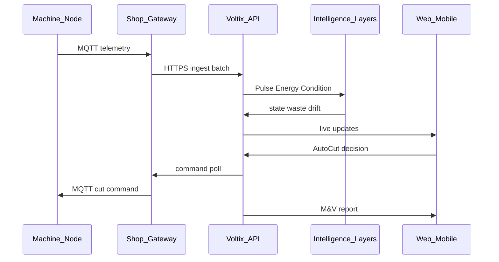

### 6.4 Node classes in architecture

| Class        | Sensing | Actuation                    | Typical assets                         |
| ------------ | ------- | ---------------------------- | -------------------------------------- |
| AUTO-capable | Yes     | Relay within rating + policy | Approved auxiliaries, fans, some pumps |
| ALERT-ONLY   | Yes     | None                         | CNC, furnace, unknown, safety-critical |

### 6.5 Data gravity

- High-rate raw ADC streams stay on the node.
- Cloud receives RMS / estimates / status at product telemetry rates.
- History and M&V live in cloud for multi-site and export.
- Gateway buffer protects against uplink gaps.

---

## 7. Hardware system

### 7.1 Five hardware questions

| #   | Question                       | Hardware response                                             |
| --- | ------------------------------ | ------------------------------------------------------------- |
| 1   | Can we sense safely?           | Split-core CT on one conductor; licensed install              |
| 2   | Can we get clean enough data?  | Burden, bias, filter, sampling, RMS on node                   |
| 3   | Can we get data off the floor? | Wi-Fi MCU to MQTT to Pi gateway to buffer to cloud            |
| 4   | Can we act safely?             | Contactor/relay class with NC fail-safe, override, never-AUTO |
| 5   | Can we survive the shop?       | Enclosure path, thermal, EMI awareness, industrial roadmap    |

### 7.2 Hardware roles diagram

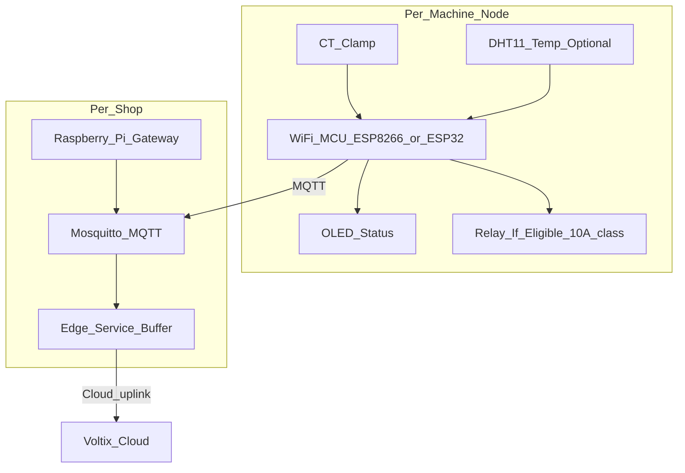

### 7.3 Locked V1 hardware decisions

| Decision     | Lock                                           |
| ------------ | ---------------------------------------------- |
| Sensing      | CT-only primary; estimated kW                  |
| Voltage / PF | Nominal V + assumed PF per machine             |
| Temperature  | DHT11 enclosure / ambient context              |
| Node MCU     | ESP8266 / ESP32 class                          |
| Display      | OLED local status                              |
| Actuation    | ~10A relay only on electrically eligible loads |
| Gateway      | Raspberry Pi + MQTT + local buffer             |
| Hybrid       | Edge + cloud                                   |

### 7.4 CT selection

| Concern            | Guidance                                                        |
| ------------------ | --------------------------------------------------------------- |
| Form factor        | Split-core for brownfield install without cutting cable         |
| Range              | Match machine expected current with headroom                    |
| Accuracy class     | Fit-for-purpose operational M&V — not utility meter class in V1 |
| Safety             | Insulated install on correct conductor; competent electrician   |
| One CT per machine | Primary attribution model                                       |

### 7.5 Signal chain


Product requirements:

- Burden sized so ADC sees usable amplitude without clipping under expected peaks.
- Bias centers AC waveform in MCU ADC range.
- Light filtering reduces aliasing and shop EMI junk.
- Edge compute: publish RMS / estimates / health — not continuous raw waveform streams.
- Sampling rate sufficient for RMS stability on 50 Hz mains.

### 7.6 Node compute responsibilities

| On node                           | Not on node V1                  |
| --------------------------------- | ------------------------------- |
| Sample and RMS                    | Full GMM training               |
| Estimated kW with configured V/PF | Multi-year M&V archives         |
| Local OLED state                  | Heavy Isolation Forest training |
| MQTT publish + command listen     | Cross-site analytics            |
| Local fail-safe defaults          | Owner authentication UI         |

### 7.7 AUTO vs ALERT-ONLY node classes

| Class        | Relay                            | Policy                                   | Examples                                                  |
| ------------ | -------------------------------- | ---------------------------------------- | --------------------------------------------------------- |
| AUTO-capable | Present within rating            | May enter AUTO if whitelist + gates pass | Selected compressor circuits, blowers, non-critical pumps |
| ALERT-ONLY   | No relay or permanently disabled | Monitor + alert + rank only              | CNC, furnace, presses mid-cycle class, unknown loads      |

**Product rule:** Presence of a relay does not equal permission to AUTO. Eligibility is a policy object, not a solder joint.

### 7.8 Actuation and fail-safe

| Requirement                                                        | Intent                                       |
| ------------------------------------------------------------------ | -------------------------------------------- |
| Contactor path toward IS 13947 class devices on production roadmap | Industrial interruption practice             |
| NC fail-safe / power-ON default on loss of control authority       | Cloud/node glitch must not remove power path |
| Manual override returns power immediately                          | Operator trust                               |
| Local actuation decision gated by eligibility                      | No remote cowboy cuts                        |
| ~10A relay class in V1 prototype path                              | Hard electrical eligibility limit            |

| Failure                    | Required behaviour                         |
| -------------------------- | ------------------------------------------ |
| Cloud unreachable          | Power remains ON; no forced remote cut     |
| MQTT broker down           | Local default power ON; buffer telemetry   |
| Node reboot                | Safe default; re-join; no surprise AUTO    |
| Ambiguous Pulse confidence | Do not AUTO; alert if sustained            |
| Override pressed           | Immediate power path restore; latch logged |

### 7.9 BOM order of magnitude

| Item                       | Role                 | Cost band                 |
| -------------------------- | -------------------- | ------------------------- |
| Split-core CT              | Sense                | Low–mid                   |
| ESP8266/ESP32 board        | Node compute + Wi-Fi | Low                       |
| Burden/bias/passives       | Signal conditioning  | Low                       |
| DHT11                      | Temp context         | Very low                  |
| OLED                       | Local trust          | Low                       |
| Relay module eligible only | Actuate              | Low                       |
| Enclosure / DIN path       | Survive shop         | Mid rising for industrial |
| Raspberry Pi + SD + PSU    | Gateway              | Mid                       |
| Cabling / install labour   | Commissioning        | Site-dependent            |

Starter kit economics (~Rs 25–35k) cover gateway + first 3–5 nodes + install margin.

### 7.10 Gateway product role

| Function                   | Why                              |
| -------------------------- | -------------------------------- |
| MQTT broker                | Shop-local telemetry bus         |
| Buffer / store-and-forward | Flaky MSME internet              |
| HTTPS uplink               | Cloud ingest                     |
| Command fan-out            | Policy-approved AutoCut commands |
| Edge health                | Node online matrix               |

### 7.11 Sensing policy summary

| Signal       | V1 stance                          |
| ------------ | ---------------------------------- |
| Current CT   | Mandatory                          |
| Voltage      | Assumed / nominal; VT / ZMPT later |
| Power factor | Assumed configurable per machine   |
| Temperature  | Supported DHT11                    |
| Vibration    | Phase-2 optional                   |

### 7.12 Hardware honesty

- V1 is a productized prototype path toward enclosed industrial nodes — not a claim of completed BIS certification on day one.
- Electrical work requires competent/licensed install.
- Estimated kW is for operational decisions and M&V-style evidence, not billing disputes with the utility.

---

## 8. Software / intelligence platform overview

### 8.1 Layered decision engine

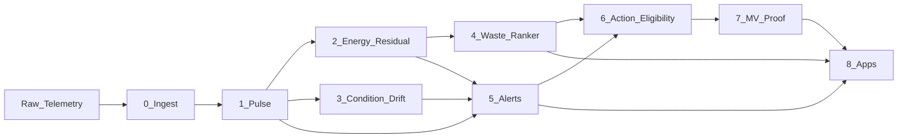

| #   | Layer              | Question answered                             | Method                                     |
| --- | ------------------ | --------------------------------------------- | ------------------------------------------ |
| 0   | Ingest             | Is the packet valid, timed, and attributable? | Schema validation, device auth, buffering  |
| 1   | Pulse              | What is the machine doing?                    | Rules then GMM to OFF/ACTIVE/IDLE/WASTE    |
| 2   | Energy residual    | How much draw is avoidable waste?             | Baseline idle vs live residual             |
| 3   | Condition / drift  | While ACTIVE, is behaviour abnormal?          | Baseline / Isolation Forest flag           |
| 4   | Rupee Waste Ranker | What should we look at first?                 | Explainable rules                          |
| 5   | Alerts             | When do we interrupt the owner?               | Triggers, severity, dedupe                 |
| 6   | Action eligibility | May we act automatically?                     | Whitelist, confidence, debounce, never-cut |
| 7   | M&V proof          | What did we save after we acted?              | Baseline vs intervention                   |
| 8   | Apps               | How does the owner see and approve?           | Web ops + mobile                           |

### 8.2 Contextualize by state before energy/condition

**Critical product rule:** Energy residual and Condition models must be state-aware.

- Condition primarily evaluates ACTIVE windows.
- Energy residual focuses on IDLE/WASTE-like behaviour.
- Mixing states without Pulse context creates false drift and false waste.

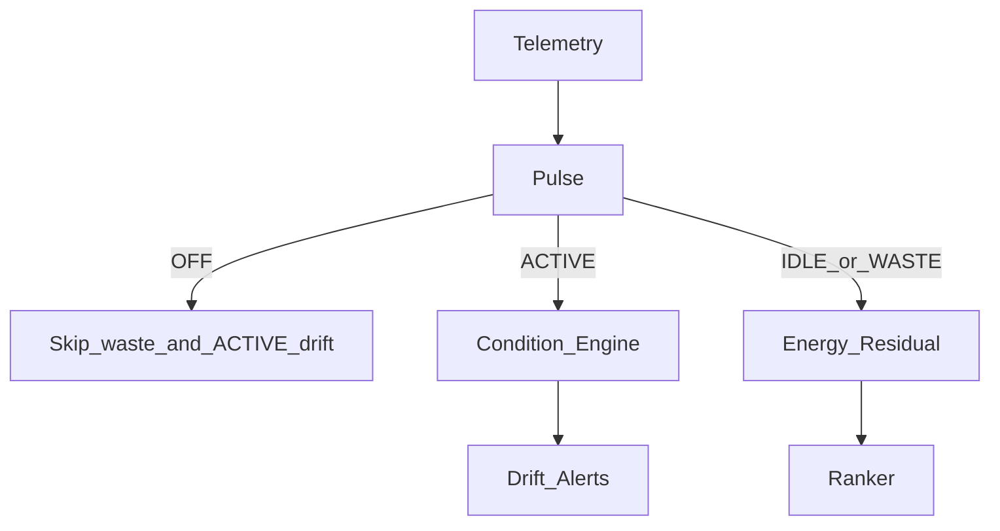

### 8.3 Model ownership

| Layer                                 | Intelligence form                                 |
| ------------------------------------- | ------------------------------------------------- |
| Pulse                                 | Per-machine GMM after rules baseline              |
| Condition                             | Per-machine ACTIVE drift / Isolation Forest-class |
| Ranker + Alerts + AutoCut gates + M&V | Explainable rules                                 |

### 8.4 Deployment shape

Hybrid: shop gateway + cloud platform. Survives flaky MSME internet via local buffer. Cloud: multi-site history, auth, apps, M&V. Apps: web ops console + mobile.

### 8.5 Platform non-functional requirements

| NFR                   | Intent                                    |
| --------------------- | ----------------------------------------- |
| Attribution integrity | device_id to machine_id mapping trusted   |
| Time integrity        | Clock sync / gateway timestamp policy     |
| Alert hygiene         | Cooldown, dedupe, resolve                 |
| Auditability          | Action and override logs for liability    |
| Explainability        | Ranker reasons visible to owner           |
| Safety defaults       | Fail-safe ON encoded in policy + hardware |

### 8.6 What done looks like for software V1

- Continuous ingest from commissioned nodes
- Stable Pulse states with debounce
- Waste rupee ranking daily
- Drift flags on ACTIVE anomalies
- Alert delivery without fatigue collapse
- AutoCut only on eligible approved loads
- Exportable M&V report after intervention windows

---

## 9. Layer 0 — Ingest

### 9.1 Purpose

Ingest answers: **Is this packet valid, timed, authenticated, and attributable to a commissioned machine?** Without Ingest integrity, every downstream layer hallucinates on garbage.

### 9.2 Responsibilities

| Responsibility           | Why it matters                                             |
| ------------------------ | ---------------------------------------------------------- |
| Device authentication    | Prevent spoofed nodes from poisoning rankings              |
| Schema validation        | Reject malformed telemetry early                           |
| Timestamp policy         | Align node clock skew via gateway receive time when needed |
| Machine binding          | Map `device_id` to `machine_id` and site                   |
| Deduplication            | Handle MQTT redelivery / buffer replay                     |
| Buffering acknowledgment | Survive uplink gaps without silent loss                    |
| Rate and health metrics  | Detect offline / flapping nodes                            |

### 9.3 Ingest flow

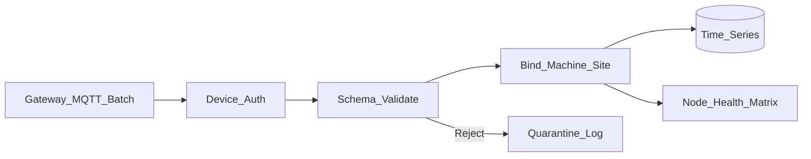

### 9.4 Quality gates before Pulse

| Gate                    | Example failure            | Action                    |
| ----------------------- | -------------------------- | ------------------------- |
| Auth fail               | Unknown device key         | Drop + security log       |
| Out-of-range current    | Impossible RMS for CT size | Quarantine; do not train  |
| Missing machine binding | Uncommissioned node        | Hold in staging           |
| Clock absurdity         | Year 1970 timestamps       | Prefer gateway time; flag |
| Burst flood             | Misconfigured publish rate | Throttle + alert ops      |

### 9.5 Edge vs cloud split

| At gateway                  | At cloud Ingest              |
| --------------------------- | ---------------------------- |
| Local buffer during outage  | Durable store                |
| Batching / compression      | Auth against fleet registry  |
| Basic offline queue metrics | Cross-site tenancy isolation |

### 9.6 Product outputs of Ingest

- Clean time series of `i_rms_a`, `kw_est`, `temp_c`, link health
- Node online/offline state for Alerts
- Commissioning completeness flags for Apps

Ingest is unglamorous and non-negotiable. Judges should hear: **Voltix does not skip data hygiene.**

---

## 10. Layer 1 — Pulse

### 10.1 Purpose

Pulse answers: **What is the machine doing right now?** It converts continuous electrical behaviour into operating states that every other layer depends on.

**Honesty:** Pulse enables everything downstream; it is enabling technology, not the marketing USP alone.

### 10.2 States

| State      | Meaning                            | Typical electrical cue                       |
| ---------- | ---------------------------------- | -------------------------------------------- |
| **OFF**    | Negligible draw                    | Near-zero RMS                                |
| **ACTIVE** | Productive / loaded work signature | Higher band, often more variance             |
| **IDLE**   | Powered but not productive         | Mid/low sustained band                       |
| **WASTE**  | Avoidable burn                     | Prolonged unloaded / should-be-off behaviour |

WASTE is a **policy-labelled** refinement of non-productive powered behaviour (duration, machine class, time-of-day rules may promote IDLE to WASTE).

### 10.3 Why states before energy and condition

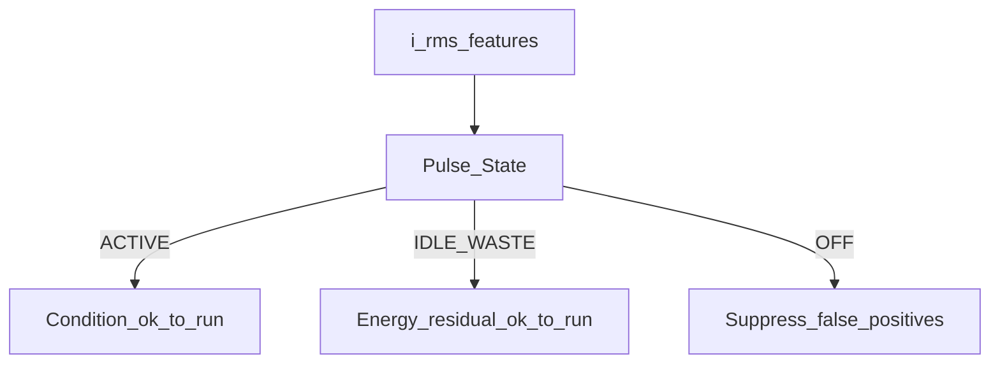

If you run condition models on IDLE windows, you invent false deterioration. If you call all non-zero current “waste,” you insult productive process heat. Pulse is the contextualizer.

### 10.4 Product model path

| Stage           | Method                                           | Role              |
| --------------- | ------------------------------------------------ | ----------------- |
| Commissioning   | Per-machine thresholds / signature learning      | Bootstrap         |
| V1 intelligence | `rules-v1` thresholds + debounce                 | Ship reliability  |
| Next            | Per-machine **GMM** on current features `gmm-v1` | Adaptive clusters |
| Always          | Debounce before commit                           | Anti-flicker      |

### 10.5 Rules-v1 (conceptual)

Rules-v1 is intentionally boring and shippable:

1. Define OFF threshold near noise floor for that CT/machine.
2. Define ACTIVE lower bound from observed loaded operation during commissioning.
3. Band between OFF and ACTIVE is candidate IDLE.
4. Duration and machine-class rules may label prolonged IDLE as WASTE (for example compressor unload beyond N minutes during shift).
5. Debounce: require K consecutive windows or T seconds before state transition commits.

### 10.6 GMM for Pulse (deep product explanation)

**Gaussian Mixture Models** fit a small set of Gaussian components to feature vectors derived from current (and optionally short-window statistics). Each component tends to align with an operating mode.

**Why GMM fits Pulse:**

- Machines naturally occupy a few electrical modes (off, idle, loaded, maybe a second loaded regime).
- Soft assignment yields confidence (responsibility of a point under a component).
- Per-machine GMMs respect that a lathe IDLE band is not a compressor IDLE band.

**Feature ideas (product-level, not code):**

- RMS current
- Short-window mean / variance of RMS
- Optional crest-ish proxies if computed on node
- Time-of-day as a weak prior (not a hard feature alone)

**Cluster to state map:**

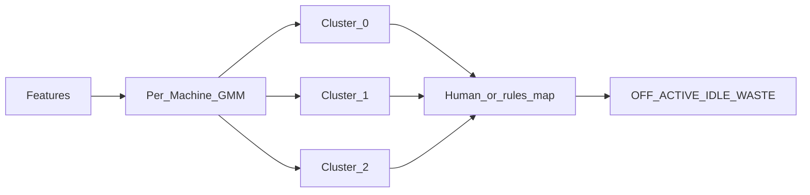

Commissioning labels (or weak rules) map clusters to states. Retraining is scheduled after major process change, not every minute.

**Confidence:** Low max responsibility or high entropy across components → hold previous debounced state or mark `uncertain` (blocks AutoCut).

### 10.7 Debounce and hysteresis

Industrial current is noisy. Without debounce:

- Ranker flickers
- Alerts spam
- AutoCut chatters contactors (dangerous and credibility-destroying)

Product debounce parameters are per machine class (compressors chatter differently than mills).

### 10.8 Pulse outputs

| Field              | Use                                      |
| ------------------ | ---------------------------------------- |
| `state`            | Downstream gate                          |
| `state_confidence` | AutoCut / alert gates                    |
| `state_since`      | Duration for WASTE promotion and ranking |
| `model_version`    | Auditability (`rules-v1` / `gmm-v1`)     |

### 10.9 Pulse failure modes and mitigations

| Failure                   | Mitigation                                  |
| ------------------------- | ------------------------------------------- |
| Mis-clamped CT            | Commissioning checklist + OLED amp sanity   |
| Wrong ACTIVE threshold    | Guided capture of loaded cycle              |
| GMM overfit on short data | Minimum learning window; fall back to rules |
| Night shift pattern shift | Time-aware rules; retrain schedule          |

### 10.10 Dataset needs for Pulse

Primary asset classes:

1. Air compressor
2. Milling / lathe
3. Press
4. Motor / fan / pump class

Dataset: time-stamped `i_rms_a` with labels or weak labels; estimated kW parameters as metadata. Public sets may bootstrap; field sets validate.

---

## 11. Layer 2 — Energy residual

### 11.1 Purpose

Energy residual answers: **How much of this draw is avoidable waste — in kW, kWh, and rupees?** Labeling IDLE is not enough; owners buy reductions in money.

### 11.2 Concept

While Pulse indicates IDLE or WASTE (and sometimes unload-like ACTIVE subclasses), the residual engine compares live estimated power against a baseline expectation for productive or minimum necessary draw.

Conceptual residual:

```text
waste_kw ≈ max(0, kw_est_live − kw_baseline_necessary)
```

For many MSME cases, `kw_baseline_necessary` during true IDLE is near a standby floor, so most of the IDLE draw is residual waste. For compressors, unload power vs productive load power is a classic residual story.

### 11.3 Estimated power in V1

```text
kw_est = (i_rms_a * v_nominal * pf_assumed) / 1000
```

| Parameter    | Source                                                                        |
| ------------ | ----------------------------------------------------------------------------- |
| `i_rms_a`    | CT + node RMS                                                                 |
| `v_nominal`  | Site / machine config (for example 230 or 415 line assumptions as applicable) |
| `pf_assumed` | Per-machine configurable assumption until measured                            |

**Honesty:** This is **estimated** power for operational prioritization and M&V-style evidence — not utility billing accuracy.

### 11.4 Tariff to rupees

| Input                        | Output                             |
| ---------------------------- | ---------------------------------- |
| `waste_kw`                   | Instant avoidable power            |
| Duration in waste-like state | `waste_kwh`                        |
| Site tariff Rs/kWh           | `waste_inr` and `waste_inr_per_hr` |

Demand charge awareness can be a later enhancement; V1 focuses on energy rupee residual clarity.

### 11.5 Flow

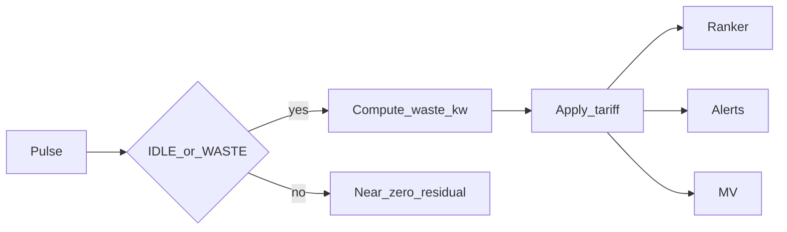

### 11.6 Baselines

| Baseline type                 | Use                            |
| ----------------------------- | ------------------------------ |
| Commissioning idle floor      | Simple residual                |
| Rolling statistical idle      | Adapt to seasons lightly       |
| Process-aware necessary power | Advanced; not required day one |

### 11.7 Outputs

- `waste_kw`, `waste_kwh_today`, `waste_inr_today`, `waste_inr_per_hr`
- Confidence tied to Pulse confidence and estimation flags (`pf_assumed` tagged)

### 11.8 Limits

- Does not localize compressed-air leaks without flow sensing
- Does not replace a class-N energy meter for disputes
- Furnace “waste” may be process-necessary heat — Pulse + human policy must prevent false residual aggression

---

## 12. Layer 3 — Condition / drift (first-class module)

> **Product lock:** Condition is not a side alert. It is Layer 3 in the Voltix intelligence stack, peer to Pulse and Energy, feeding Alerts and owner workflows — and **not** by itself authorizing AutoCut on production machines.

### 12.1 Purpose

Condition answers: **While this machine is ACTIVE, is its electrical behaviour drifting from its own normal?**

It provides early **condition awareness** from electrical behaviour — separate from waste economics.

### 12.2 What Condition is — and is not

| Condition is                                                   | Condition is not                                     |
| -------------------------------------------------------------- | ---------------------------------------------------- |
| Trend / drift / anomaly flagging on ACTIVE electrical features | Full predictive maintenance suite                    |
| Per-machine baseline or Isolation Forest-class score           | Bearing RUL prophecy                                 |
| Maintenance **attention** signal                               | Vibration diagnostics (unless Phase-2 sensors added) |
| Input to drift alerts and ranker annotations                   | Automatic shutdown authority for CNC/furnace         |

### 12.3 Why Condition must be state-gated

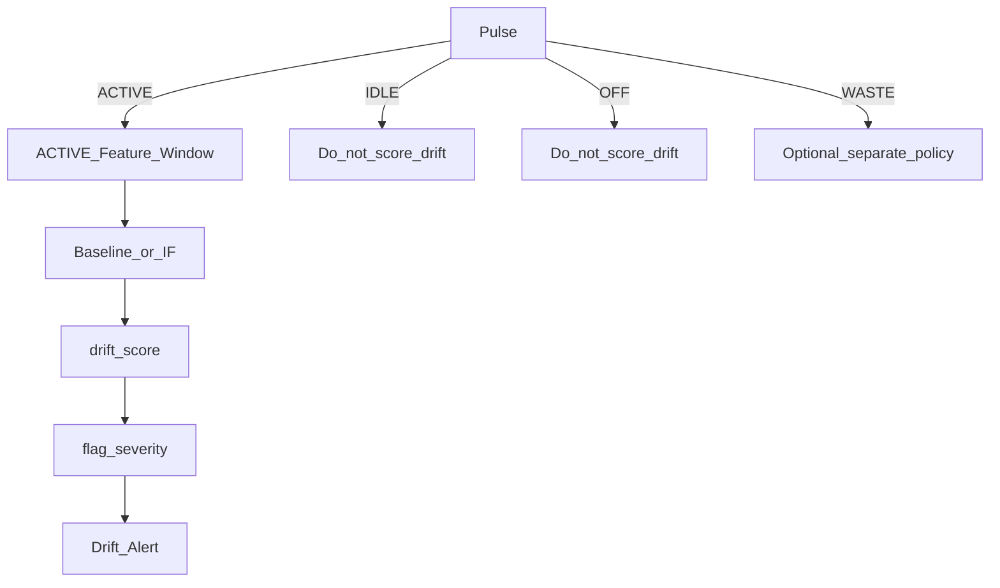

ACTIVE-only scoring prevents “the machine is idle so it looks abnormal” nonsense.

### 12.4 Due-diligence framing

Among the five daily questions, Condition owns **“what is deteriorating?”** after Pulse establishes **doing** and **normal**. Energy owns wasting. Ranker/Action own what to do. Conflating these questions is how products become untrustworthy.

### 12.5 Feature space (product-level)

For V1 CT-first:

| Feature family    | Examples                                           |
| ----------------- | -------------------------------------------------- |
| Level             | ACTIVE RMS mean                                    |
| Spread            | ACTIVE RMS variance / IQR                          |
| Shape over window | Short-term trend slope                             |
| Relative          | Deviation from machine ACTIVE centroid             |
| Context           | Temp enclosure as weak covariate (not winding PdM) |

Phase-2 may add vibration bands; V1 does not depend on them.

### 12.6 Baseline method

1. Collect N days of Pulse-labelled ACTIVE windows after commissioning.
2. Estimate normal band (mean ± k·σ, quantiles, or robust center/scatter).
3. Score new ACTIVE windows for distance from band.
4. Require persistence (M of N windows) before flagging.

Baseline is explainable: “ACTIVE current is 18% above this machine’s normal band for 40 minutes.”

### 12.7 Isolation Forest method

**Isolation Forest** is a lightweight anomaly approach well suited to unlabeled ACTIVE feature vectors:

- Isolates rare points with short path lengths in random partitions.
- Fits MSME reality: few failure labels, lots of normal operation.
- Produces a score convertible to `drift_score` and severity tiers.

**Product path:**

| Stage        | Method                                         |
| ------------ | ---------------------------------------------- |
| Early        | Robust baseline bands                          |
| Assigned R&D | Isolation Forest / one-class model per machine |
| Always       | Persistence + severity + human message         |

### 12.8 Outputs

| Field                   | Meaning                           |
| ----------------------- | --------------------------------- |
| `drift_score`           | 0–1 or standardized anomaly score |
| `flag`                  | boolean attention                 |
| `severity`              | info / warn / high                |
| `message`               | Human-readable, machine-specific  |
| `model_version`         | baseline-v1 / iforest-v1          |
| `active_only_guarantee` | Audit field that Pulse was ACTIVE |

### 12.9 How Condition feeds the rest of the product

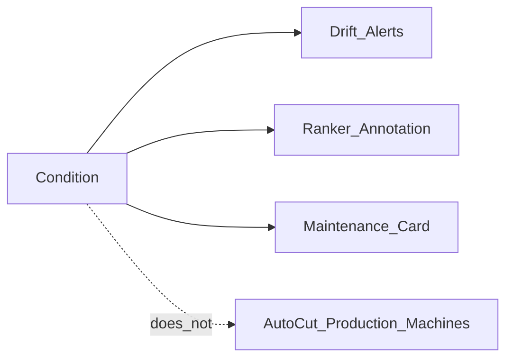

- **Alerts:** `drift` type with cooldown
- **Ranker:** may surface “inspect” rows even when waste rupees are low
- **Apps:** maintenance attention list distinct from waste list
- **AutoCut:** Condition does **not** auto-stop CNC/furnace; at most it can contribute to blocking AUTO if behaviour is too abnormal to trust waste classification

### 12.10 Condition vs Energy (keep them separate)

| Dimension      | Energy residual                           | Condition                          |
| -------------- | ----------------------------------------- | ---------------------------------- |
| Primary states | IDLE / WASTE                              | ACTIVE                             |
| Owner language | Rupees wasted                             | Machine seems off-normal           |
| Action         | Cut / schedule shutdown of eligible loads | Inspect / maintain                 |
| Success metric | kWh and Rs saved                          | Earlier catch of electrical oddity |

### 12.11 Failure modes

| Failure                      | Risk                       | Mitigation                        |
| ---------------------------- | -------------------------- | --------------------------------- |
| Training on mixed states     | False drift                | Hard ACTIVE gate                  |
| Process change (new tooling) | False high score           | Retrain / baseline reset workflow |
| CT slip                      | Sudden level shift         | Hardware sanity + install check   |
| Alert fatigue                | Ignored flags              | Severity, persistence, cooldown   |
| Overclaiming PdM             | Liability / judge distrust | Honest vocabulary: drift flag     |

### 12.12 Literature anchors for Condition

- Motor current signature analysis (MCSA) philosophy — electrical signatures carry fault information; Voltix V1 claims **drift**, not full MCSA diagnosis.
- One-class / Isolation Forest anomaly literature — practical for unlabeled industrial streams.
- Change-point detection — optional enhancement for abrupt regime shifts.

### 12.13 Acceptance criteria for Condition V1

- Runs only on ACTIVE
- Per-machine model or baseline
- Emits score + flag + message
- Creates drift alerts without spamming
- Visible in Apps as distinct from waste
- Documented as drift awareness, not RUL

### 12.14 Deep scenario walkthrough

**Scenario:** Lathe 2 normally draws ~9–11 A RMS when ACTIVE cutting. Over two weeks, ACTIVE mean climbs to ~13–14 A with higher variance, while Pulse still says ACTIVE (parts are being made). Energy residual may look fine because the machine is “working.” Condition flags drift: “ACTIVE current above baseline — inspect mechanical load, tool wear, supply issues, or CT path.” Works manager schedules inspection before a hard failure week. No AutoCut occurred — correctly.

This scenario is why Condition is first-class: **waste engines miss productive-but-wrong.**

---

## 13. Layer 4 — Ranker

### 13.1 Purpose

Ranker answers: **What should the owner look at first?** It turns many machine states into one **owner-facing priority list** in rupees and risk language.

### 13.2 Design principles

- Explainable rules (`rules-ranker-v1`) over black-box ranking
- Rupee-first ordering for waste
- Annotations for drift and AutoCut eligibility
- Stable ordering (hysteresis) to avoid list thrash

### 13.3 Conceptual score

```text
score ≈ w1 * waste_inr_per_hr
        + w2 * waste_duration_factor
        + w3 * criticality
        + w4 * drift_attention_bonus
        + w5 * autocut_opportunity_bonus
```

Weights are product policy, visible in admin config, not hidden ML.

### 13.4 Example ranked day

| Rank | Machine      | Signal                  | Suggested action            |
| ---- | ------------ | ----------------------- | --------------------------- |
| 1    | Compressor 2 | WASTE 18m · Rs 38/hr    | Enable AUTO / inspect leaks |
| 2    | Press 1      | IDLE prolonged          | Alert supervisor            |
| 3    | Lathe 2      | Drift flag while ACTIVE | Inspect                     |
| 4    | Blower 3     | IDLE · AutoCut eligible | Approve AUTO                |

### 13.5 Ranker inputs and outputs

| Inputs                 | Outputs               |
| ---------------------- | --------------------- |
| Pulse state + duration | Ranked list           |
| Energy residual rupees | Explain strings       |
| Condition flags        | Eligibility tags      |
| Machine criticality    | Suggested action enum |

### 13.6 Flow

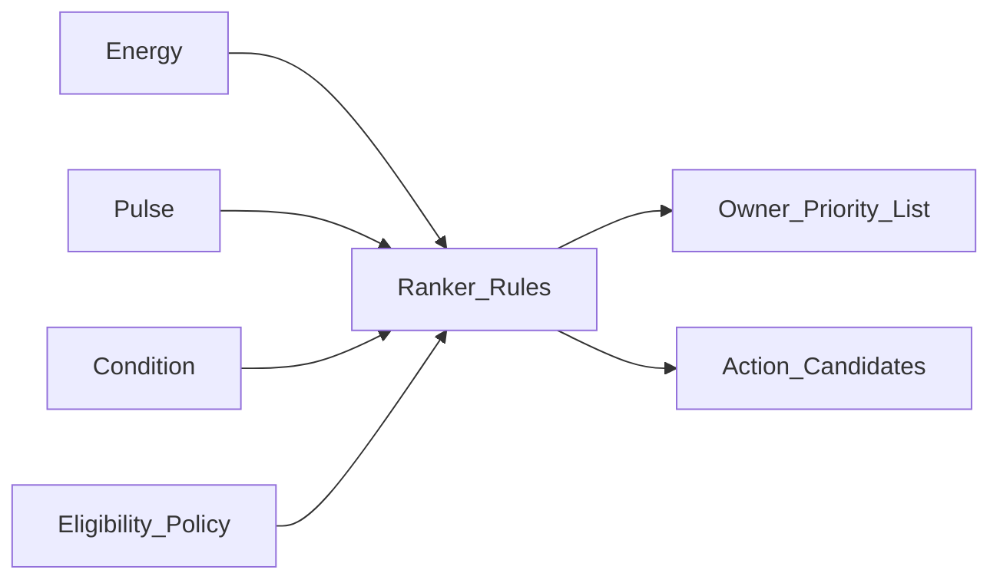

---

## 14. Layer 5 — Alerts

### 14.1 Purpose

Alerts answer: **When do we interrupt a human?** Interruption is expensive; alert hygiene is a product feature.

### 14.2 Alert types

| Type      | Intent                            |
| --------- | --------------------------------- |
| `waste`   | Sustained avoidable energy burn   |
| `offline` | Node / telemetry silence          |
| `drift`   | Condition layer flag while ACTIVE |

### 14.3 Rules-alerts-v1 concepts

| Rule element | Example                                                          |
| ------------ | ---------------------------------------------------------------- |
| Trigger      | WASTE longer than T minutes AND waste_inr_per_hr above X         |
| Severity     | info / warn / critical                                           |
| Dedupe key   | machine_id + type                                                |
| Cooldown     | Do not re-page for N minutes                                     |
| Resolve      | State leaves WASTE for M minutes; node back online; drift clears |

### 14.4 Anti-fatigue policy

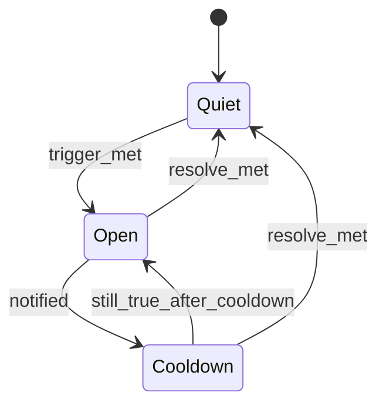

### 14.5 Channels

- Mobile push / in-app for owners
- Web console banners for managers
- Optional SMS later
- Never rely on email-only for critical offline safety of sensing (sensing offline is not power cut)

### 14.6 Alert vs AutoCut

Alerts are the default action path. AutoCut is a separate privileged path. Many MSME deployments may remain ALERT-ONLY forever on most machines — and still succeed via Ranker + M&V.

---

## 15. Layer 6 — Action / AutoCut

### 15.1 Purpose

Action eligibility answers: **May we act automatically — and how?** AutoCut is optional enforcement on approved loads, not the identity of Voltix.

### 15.2 Modes per machine

| Mode    | Behaviour                                     |
| ------- | --------------------------------------------- |
| MONITOR | Sense + Pulse + Energy + Condition only       |
| ALERT   | MONITOR + interrupt humans                    |
| AUTO    | ALERT + policy-gated cut on eligible hardware |

### 15.3 Eligibility gates (conceptual AND)

Auto allowed only if roughly all true:

- Waste (or eligible idle) confirmed with sufficient Pulse confidence
- Machine on **approved whitelist**
- Node class is AUTO-capable (relay present and healthy)
- Not on never-AUTO list
- Not safety-critical / not mid-cycle class
- Duration debounce satisfied
- No manual override latch
- Command path authenticated
- Electrical rating respected (~10A class V1)

### 15.4 Never-AUTO by default

Furnaces, CNC mid-cycle class loads, unknown machines, safety-critical auxiliaries, anything outside relay rating, anything the owner has not explicitly approved.

### 15.5 Fail-safe interaction

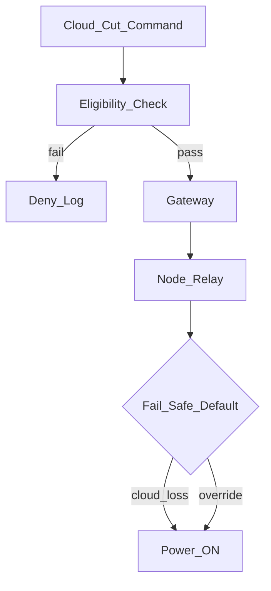

**Cloud loss = power ON.** This is a product non-negotiable.

### 15.6 Adaptive Action framing

“Adaptive” means policy adapts to confidence, duration, time-of-day, and machine class — not that an unconstrained RL agent invents cuts. Rules remain auditable.

### 15.7 Commercial module

AutoCut is packaged as an add-on: extra hardware where needed + policy enablement + possibly higher support burden — priced separately from core monitoring subscription.

---

## 16. Layer 7 — M&V

### 16.1 Purpose

M&V answers: **What did we save after we acted?** Without Prove, Sense–Act is a story. With Prove, Voltix becomes accountable infrastructure for owners and schemes.

### 16.2 Conceptual IPMVP-aligned practice

| Step             | Voltix product object                                    |
| ---------------- | -------------------------------------------------------- |
| Baseline period  | Pre-intervention kWh/Rs estimate window                  |
| Reporting period | Post-alert / post-AutoCut / post-behaviour-change window |
| Adjustments      | Optional production/schedule notes (manual in V1)        |
| Report           | Export CSV / PDF style evidence                          |

### 16.3 Flow

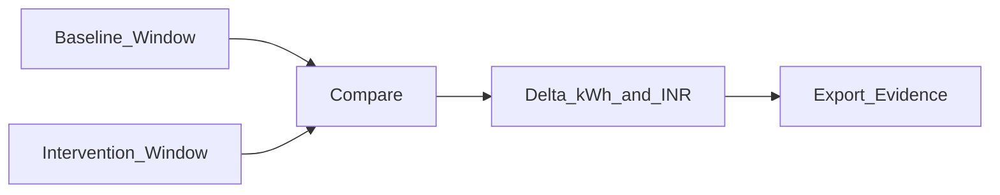

### 16.4 Honesty bounds

- CT-estimated energy is for **operational M&V and prioritization**
- Not a substitute for utility billing meters unless later certified
- Clearly tag estimation assumptions (V, PF) on exports

### 16.5 Why M&V is strategic

- Unlocks scheme conversations
- Unlocks expansion node sales
- Defends ROI against skepticism
- Differentiates from cheap meters

---

## 17. Layer 8 — Applications UX

### 17.1 Surfaces

| App             | Primary user  | Jobs                                                    |
| --------------- | ------------- | ------------------------------------------------------- |
| Web ops console | Works manager | Ranker, history, config, M&V, multi-machine density     |
| Mobile          | Owner / floor | Alerts, approve AUTO, glance rupees, override awareness |

### 17.2 UX principles

- Rupees before charts
- One ranked list above vanity dashboards
- Separate **Waste** and **Condition** attention
- Make never-AUTO and fail-safe visible (trust UI)
- OLED on machine should not contradict the app

### 17.3 Core screens (product)

1. Today’s ranked waste
2. Machine detail (Pulse timeline, residual, drift)
3. Alerts inbox
4. AutoCut approvals / whitelist
5. M&V reports
6. Node health
7. Commissioning wizard

### 17.4 Trust loop

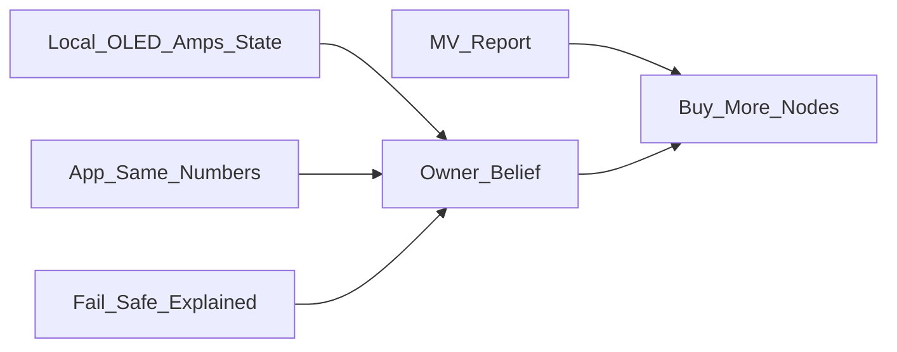

---

## 18. Data model & contracts

### 18.1 Design stance

This chapter is **conceptual**. It defines the product contracts between hardware, gateway, engines, and apps — not an OpenAPI dump or SQL schema dump.

### 18.2 Core entities

| Entity           | Meaning                               |
| ---------------- | ------------------------------------- |
| Site             | One factory / shop tenancy            |
| Machine          | Logical asset (compressor-2, lathe-1) |
| Device / Node    | Physical Voltix node                  |
| Gateway          | Shop edge computer                    |
| TelemetryPoint   | Time-stamped measurement              |
| PulseStateEvent  | Debounced state commitment            |
| ResidualEstimate | Waste power / energy / money          |
| ConditionScore   | Drift score on ACTIVE                 |
| RankSnapshot     | Ordered list at a time                |
| Alert            | Interrupt object                      |
| ActionPolicy     | Mode, whitelist, gates                |
| ActionCommand    | Cut / restore request                 |
| OverrideEvent    | Local or app override                 |
| MVBaseline       | Baseline window definition            |
| MVReport         | Savings evidence artifact             |
| Tariff           | Rs/kWh and metadata                   |

### 18.3 Binding rules

- One primary CT node maps to one machine in V1 (clarity over clever multi-CT fusion).
- A machine may be ALERT-ONLY even if a relay exists physically (policy wins).
- Telemetry without machine binding does not enter Pulse training.

### 18.4 Telemetry contract (node to platform)

| Field              | Role                                     |
| ------------------ | ---------------------------------------- |
| `device_id`        | Physical node identity                   |
| `machine_id`       | Logical asset (may be bound server-side) |
| `ts`               | Sample time                              |
| `i_rms_a`          | Primary signal                           |
| `v_nominal`        | Estimation parameter                     |
| `pf_assumed`       | Estimation parameter                     |
| `kw_est`           | Estimated power                          |
| `temp_c`           | Optional DHT11                           |
| `link_quality`     | Optional health                          |
| `firmware_version` | Supportability                           |

### 18.5 Engine output contracts

| Engine    | Key outputs                                                 |
| --------- | ----------------------------------------------------------- |
| Pulse     | state, confidence, since, model_version                     |
| Energy    | waste_kw, waste_kwh, waste_inr, waste_inr_per_hr            |
| Condition | drift_score, flag, severity, message                        |
| Ranker    | rank, score, explain, suggested_action                      |
| Alerts    | type, severity, open/resolve                                |
| AutoCut   | eligible, mode, last_command, deny_reason                   |
| M&V       | baseline_kwh, report_kwh, delta_kwh, delta_inr, assumptions |

### 18.6 Command contract (platform to node)

| Field                      | Role                     |
| -------------------------- | ------------------------ |
| `command_id`               | Idempotency              |
| `machine_id` / `device_id` | Target                   |
| `action`                   | CUT / RESTORE / NOOP     |
| `policy_version`           | Audit                    |
| `expires_at`               | Stale command protection |
| `signature`                | Auth                     |

Nodes must ignore expired or unauthorized commands and remain fail-safe ON on uncertainty.

### 18.7 Event log (liability spine)

Every AutoCut, deny, override, and mode change is append-only logged with who/what/when/why. This is product, not bureaucracy.

---

## 19. Literature review & prior art

### 19.1 Purpose of this review

Voltix sits at the intersection of industrial energy management, non-intrusive sensing, motor diagnostics philosophy, statistical mode detection, anomaly detection, IIoT architecture, and measurement & verification practice. This chapter positions the product against that literature honestly: **combinatorial MSME productization**, not “we invented the CT.”

### 19.2 MSME energy and policy literature (problem side)

Indian and international development literature consistently describes MSMEs as energy-intensive relative to output, capital-constrained, information-poor, and weakly instrumented.

**Directional themes from BEE-linked programmes, SAMEEEKSHA cluster documents, CEEW/TERI analyses, and FEEMP-style World Bank narratives:**

1. **Audit without continuity** — One-time audits identify measures; implementation and persistence lag.
2. **Cross-cutting systems dominate waste** — Compressed air, motors/drives, process heat, and inefficient combustion or electrical distribution appear repeatedly.
3. **Idle and unloaded operation** — Known loss mode, rarely continuously enforced.
4. **Skills and staffing** — Few shops employ dedicated energy managers.
5. **Finance and proof** — Schemes and ESCOs need credible savings evidence; MSMEs struggle to produce it.

Voltix product implication: continuous observation + rupee prioritization + optional safe actuation + native M&V is a better fit than another audit PDF generator.

### 19.3 Compressed air and motor systems

Compressed-air literature (DOE tip sheets, industrial energy handbooks, cluster case studies) emphasizes:

- Generation is expensive per useful joule delivered
- Leaks and artificial demand dominate many plants
- Load/unload and modulation behaviours hide waste behind “compressor running”

Motor-systems literature emphasizes:

- Oversizing, poor loading, and idle running
- Efficiency upgrades help, but **which motor** and **which behaviour** matter first
- VFDs are not a substitute for operational visibility

Voltix product implication: compressor + motor/fan/pump classes are first-class assets for Pulse and residual models; leak localization is explicitly out of V1 claims without flow sensing.

### 19.4 NILM vs dedicated CT attribution

**Non-Intrusive Load Monitoring (NILM)** research (Hart and successors) disaggregates appliances from a single point of measurement using event detection and signature models.

| NILM                            | Voltix V1                                    |
| ------------------------------- | -------------------------------------------- |
| One (or few) meters, many loads | One CT per prioritized machine               |
| Hard attribution problem        | Simpler attribution                          |
| Strong in buildings research    | Strong in brownfield factory Pareto installs |
| Privacy/complexity tradeoffs    | Shop-owner clarity tradeoffs                 |

Voltix is a **philosophical cousin** to NILM (learn behaviour from electrical signals) but chooses **dedicated CT attribution** for MSME trust and simplicity. Facility-level NILM may appear later as an expansion analytic, not the V1 spine.

### 19.5 Motor Current Signature Analysis (MCSA)

MCSA literature shows that stator current carries information about mechanical and electrical faults (broken rotor bars, misalignment, load changes) via spectral signatures.

Voltix relationship:

- **Inspired by** the idea that electrical behaviour encodes condition
- **Does not claim** full spectral MCSA diagnostics in V1
- Uses RMS/feature drift and Isolation Forest / baseline methods as a **practical MSME approximation**
- Keeps vocabulary as **condition drift**, not fault taxonomy

This honesty matters for judges and for liability.

### 19.6 Gaussian Mixture Models for operating modes

GMM literature in clustering and speech/mode recognition supports soft assignment of observations to latent regimes. Industrial analytics papers use mixture models and hidden Markov models for machine state segmentation.

Voltix Pulse path:

- Rules first for shippability
- GMM per machine for adaptive mode capture
- Explicit cluster-to-state mapping with human/rules oversight
- Confidence from responsibilities to gate AutoCut

### 19.7 Debounce, hysteresis, and change-point ideas

Process control and industrial software practice treat noisy signals with hysteresis and confirmation counts. Change-point detection literature (CULSUM, Bayesian online change-point, Pelt, etc.) offers richer tools for regime shifts.

V1 product choice: **debounce + hysteresis** for Pulse stability; optional change-point enhancement later for Condition abrupt shifts.

### 19.8 Anomaly detection and Isolation Forest

Isolation Forest (Liu et al.) and one-class SVMs are standard for unlabeled anomaly detection. Industrial IoT surveys recommend unsupervised methods when failure labels are scarce.

Voltix Condition path:

- Baseline bands for explainability
- Isolation Forest-class model for flexible anomaly scoring on ACTIVE features
- Persistence filters to reduce false positives

### 19.9 IPMVP and M&V practice

The International Performance Measurement and Verification Protocol (IPMVP) and related M&V guidance emphasize baseline, reporting period, adjustments, and transparent uncertainty.

Voltix M&V:

- Aligns **conceptually** with baseline vs intervention comparison
- Uses estimated CT energy with tagged assumptions
- Aims at owner belief and scheme conversations — with clear non-claims vs utility meters

### 19.10 IIoT architectural prior art

MQTT, edge gateways, time-series stores, and cloud dashboards are established IIoT patterns (many vendor stacks). Prior art also includes SCADA/PLC historians in large plants.

Voltix differentiation is not MQTT itself; it is **MSME-priced retrofit + layered decision engines + safety policy + M&V**, without PLC dependency.

### 19.11 Standby shutdown and OEM features

Some OEMs and aftermarket controllers offer idle shutdown on compressors or machine tools. These are valuable but fragmented:

- Brand-specific
- Rarely shop-wide ranked
- Rarely coupled to independent M&V proof
- Often unavailable on legacy machines

Voltix positions as a **shop layer** above heterogeneous legacy assets.

### 19.12 Competitive / commercial prior art honesty

Monitoring players and IoT energy platforms exist in India and globally (from cheap DIN meters with cloud apps to enterprise EMS).

**Do not claim novelty on:** using a CT, using Wi-Fi, using MQTT, drawing a dashboard, or saying “AI.”

**Do claim product synthesis:** per-machine waste visibility + rupee ranking + policy-gated intervention + condition drift flags + built-in M&V for legacy shops without PLC at MSME price.

### 19.13 Summary table — literature to layer mapping

| Literature theme        | Voltix layer                      |
| ----------------------- | --------------------------------- |
| MSME audit gaps         | Whole product loop                |
| Compressed air / motors | Pulse + Energy + target assets    |
| NILM                    | Related; dedicated CT preferred   |
| MCSA                    | Condition inspiration             |
| GMM / mode clustering   | Pulse                             |
| Isolation Forest        | Condition                         |
| IPMVP                   | M&V                               |
| IIoT MQTT/edge          | Ingest + Gateway                  |
| OEM idle cut            | AutoCut module (shop-wide policy) |

---

## 20. Differentiation & competitive position

### 20.1 Positioning statement

Voltix is the **measurement + prioritization + proof layer** that makes MSME energy action work on legacy floors — with Condition drift as a peer intelligence module and AutoCut as optional enforcement.

### 20.2 Comparison matrix

| Capability                     | Cheap meter         | Enterprise IoT / SCADA | Voltix                          |
| ------------------------------ | ------------------- | ---------------------- | ------------------------------- |
| Per-machine visibility         | Partial             | Yes heavy              | Yes retrofit                    |
| Rupee ranked action list       | No                  | Custom                 | Native                          |
| Policy-gated idle intervention | Rare                | Some                   | Native                          |
| Condition drift flag           | Rare at this price  | Possible               | Native layer                    |
| M&V export                     | No                  | Custom                 | Native moat                     |
| MSME price / no PLC            | Yes / limited value | No                     | Yes                             |
| Fail-safe AutoCut story        | N/A                 | Varies                 | Explicit power-ON on cloud loss |

### 20.3 Differentiation pillars

1. **Closed loop** Sense → Verify → Decide → Act → Prove
2. **Rupee Ranker** as default UI truth
3. **Condition first-class** without PdM overclaim
4. **Safety policy** as product (never-AUTO, ALERT-ONLY class)
5. **Price** matched to Rs 1–5L bill shops
6. **Brownfield** CT-first install

### 20.4 What NOT to claim in sales or SIH

- Billing-grade accuracy
- Full predictive maintenance / failure day prediction
- Counting good parts from current alone
- Air-leak pin-pointing without flow sensors
- Unrestricted AutoCut on arbitrary production machines
- Replacement of SCADA in large plants
- Residential Voltify feature parity

### 20.5 Moat hypothesis

Hardware BOM is not the moat. The moat is **dataset of machine-state behaviours + trusted policy library + M&V habit + cluster distribution**. Competitors can bolt a CT; fewer can earn owner trust to act and prove.

---

## 21. Safety, liability, compliance path

### 21.1 Safety philosophy

Production continuity and human safety outrank clever automation. Voltix would rather miss a cut than strand a shop or interrupt a mid-cycle CNC.

### 21.2 Non-negotiables

| Rule                               | Rationale                   |
| ---------------------------------- | --------------------------- |
| Cloud unreachable implies power ON | Avoid remote bricking       |
| Manual override immediate          | Operator supremacy          |
| Never-AUTO list                    | Asset class reality         |
| Licensed electrical install        | Mains risk                  |
| Relay rating respected             | Fire / contact failure risk |
| Audit log of actions               | Liability spine             |

### 21.3 Fail-safe table

| Failure              | Behaviour                |
| -------------------- | ------------------------ |
| Cloud loss           | Power ON; buffer data    |
| Broker loss          | Power ON; local defaults |
| Ambiguous confidence | No AUTO                  |
| Override             | Power restored; latch    |
| Policy deny          | No command dispatch      |

### 21.4 Hardware compliance path (roadmap honesty)

| Stage             | Focus                                                                   |
| ----------------- | ----------------------------------------------------------------------- |
| V1 prototype path | Functional safety behaviour, basic enclosure                            |
| Near-term         | Industrial enclosure, proper contactor (IS 13947 direction), labeling   |
| Later             | Broader certifications as scale demands (BIS and related as applicable) |

Do not claim completed certification prematurely.

### 21.5 Liability messaging

- Voltix advises and optionally actuates **eligible** loads under owner-approved policy
- Owner remains responsible for machine safety classification
- Condition flags are attention signals, not certificates of machine health

### 21.6 Cyber and access

Device auth, signed commands, tenancy isolation, and least-privilege apps are part of the safety story: a spoofed cut command is a safety incident.

---

## 22. Business model & GTM

### 22.1 Revenue lines

| Line                  | Role                                                    |
| --------------------- | ------------------------------------------------------- |
| Starter kit           | Gateway + first 3–5 nodes + install (~Rs 25–35k)        |
| Platform subscription | Dashboard, alerts, history, M&V (~Rs 999/mo indicative) |
| AutoCut module        | Extra hardware + policy enablement                      |
| Expansion nodes       | After first savings proof                               |
| AMC                   | Calibration / health checks                             |

### 22.2 Motion

```mermaid
flowchart LR
  Lead[Cluster_Auditor_OEM_Lead] --> Starter[Starter_Kit]
  Starter --> Learn[Learning_Period]
  Learn --> Report[First_Rupee_Report]
  Report --> Expand[Expansion_Nodes]
  Report --> Auto[Optional_AutoCut]
  Expand --> AMC[AMC_Subscription]
```

### 22.3 GTM channels

| Channel                               | Why it fits                                                   |
| ------------------------------------- | ------------------------------------------------------------- |
| **Industrial clusters**               | Peer proof; dense geography; shared machine types             |
| **BEE auditors / energy consultants** | Already trusted; need continuous follow-through tools         |
| **OEM / dealer attachments**          | Bundle with compressors / panels                              |
| **DISCOM-adjacent programmes**        | Demand-side efficiency narratives; careful partnership design |

### 22.4 Sales narrative (correct)

Lead with invisible waste + ranked rupees + proof. Offer AutoCut as optional maturity step. Show fail-safe table early to defuse fear.

### 22.5 Unit economics intuition

If starter + 12 months subscription is on the order of Rs 35–50k all-in year one, and avoidable waste on a compressor alone can be comparable monthly, payback can be short **when** the shop acts on Ranker. M&V exists to make that claim accountable rather than mythical.

### 22.6 What not to sell

- “AI that runs your factory”
- Guaranteed 30% bill cut without baseline
- AutoCut on furnace as a flex

---

## 23. Deployment & commissioning

### 23.1 Deployment phases

1. **Site survey** — Bill, machine list, candidate Pareto loads, Wi-Fi/power for gateway
2. **Safety classification** — AUTO-capable vs ALERT-ONLY
3. **Hardware install** — CT orientation, burden path, OLED check, gateway
4. **Binding** — device to machine to tariff
5. **Learning window** — 1–2 weeks typical
6. **First Ranker review** — human validates states
7. **Optional AutoCut enable** — one eligible load
8. **First M&V export**
9. **Expand**

### 23.2 Commissioning checklist (product)

| Check                            | Pass criterion             |
| -------------------------------- | -------------------------- |
| CT on correct conductor          | OLED amps respond to load  |
| OFF near zero when isolated      | Noise floor OK             |
| ACTIVE capture                   | Loaded cycle recorded      |
| IDLE capture                     | Between-jobs band recorded |
| Node online in console           | Heartbeats present         |
| Tariff set                       | Rupees non-zero sensible   |
| Never-AUTO applied               | CNC/furnace tagged         |
| Override tested if relay present | Power restores             |

### 23.3 Training the owner

15-minute ritual: open Ranker, acknowledge top waste, snooze or act, weekly M&V glance. If UX needs an engineer on site daily, product failed.

---

## 24. Roadmap V1→V2→V3

### 24.1 V1 (locked direction)

- CT-first estimated kW (nominal V, assumed PF)
- DHT11 temp context
- ESP node + Pi gateway + OLED
- Hybrid edge + cloud
- Pulse rules then GMM training
- Energy residual
- Condition baseline / Isolation Forest path
- Rules Ranker + Alerts
- AutoCut on eligible ~10A-class loads only
- M&V export
- Web + mobile basics

### 24.2 V2

- Better voltage sensing path (VT / ZMPT class) for higher fidelity kW
- Richer Condition features; optional vibration add-on
- Improved compressor-specific unload logic
- Stronger industrial enclosure / contactor path
- Multi-site portfolio for auditors
- Demand charge analytics where tariff structures need it

### 24.3 V3

- Deeper PdM partnerships (still careful claims)
- Broader certifications
- Facility-level analytics overlays
- ESCO / scheme packaging
- OEM-branded variants

```mermaid
gantt
  title Voltix product roadmap thematic
  dateFormat  YYYY
  section V1
  CT estimated stack           :2026, 1y
  section V2
  Higher fidelity sensing      :2027, 1y
  section V3
  Scale certify partner        :2028, 1y
```

_(Timeline indicative for planning narrative; adjust to actual SIH/post-SIH execution.)_

---

## 25. Team capability map

Roles are mapped to product layers (names optional in external copies).

| Capability                   | Product ownership    |
| ---------------------------- | -------------------- |
| Pulse / GMM                  | State intelligence   |
| Condition / Isolation Forest | Drift intelligence   |
| Ranker + Alerts rules        | Decision policy      |
| Hardware node + safety       | Sense / Act path     |
| Gateway / Ingest             | Edge reliability     |
| Apps / UX                    | Owner trust surfaces |
| M&V / business               | Prove + GTM          |

Locked collaboration pattern from team decisions:

- Pulse GMM track
- Condition IF track
- Ranker + Alerts rules track

Cross-cutting: dataset capture for compressor, mill/lathe, press, motor classes.

---

## 26. Risks and mitigations

| Risk                                           | Impact                  | Mitigation                                            |
| ---------------------------------------------- | ----------------------- | ----------------------------------------------------- |
| False AutoCut                                  | Trust death             | Whitelist, debounce, ALERT-ONLY default, fail-safe ON |
| Estimated kW skepticism                        | Sales friction          | Honesty + M&V relative deltas + later VT              |
| Alert fatigue                                  | Ignored product         | Cooldown, ranker-first UX                             |
| Condition false positives after process change | Nuisance                | Baseline reset workflow                               |
| Wi-Fi hostile shops                            | Data gaps               | Gateway buffer; site survey                           |
| CT install errors                              | Bad states              | OLED sanity + checklist                               |
| Overclaim PdM in pitch                         | Judge/investor distrust | Vocabulary lock                                       |
| Enterprise competitor narrative                | Positioning loss        | MSME no-PLC price wedge                               |
| Liability event                                | Business risk           | Logs, override, never-AUTO, insurance path later      |
| Dataset scarcity                               | Weak GMM/IF             | Public bootstrap + field campaign                     |

---

## 27. Judge / investor FAQ

**Q: Is Voltix just a CT dashboard?**  
A: No. Dashboard is a surface. The product is Sense→Verify→Decide→Act→Prove with Ranker, Condition, policy AutoCut, and M&V.

**Q: Why not only AutoCut?**  
A: Most value and trust come from measurement, prioritization, and proof. AutoCut is optional enforcement on eligible loads.

**Q: Will you shut my CNC?**  
A: Not by default — ALERT-ONLY / never-AUTO for CNC and furnaces.

**Q: What if internet dies?**  
A: Power stays ON. Gateway buffers. No forced remote cut.

**Q: How accurate is power?**  
A: V1 estimates from CT + nominal V + assumed PF — good for ranking and operational M&V, not utility billing disputes.

**Q: Is Condition predictive maintenance?**  
A: It is electrical drift / anomaly flagging on ACTIVE — early awareness, not RUL prophecy.

**Q: Why GMM?**  
A: Machines have natural electrical modes; GMM soft-clusters modes per machine after rules bootstrap.

**Q: Why Isolation Forest?**  
A: Few labeled failures; unsupervised anomaly scoring fits ACTIVE feature drift.

**Q: Who pays?**  
A: Owner via starter kit + subscription; auditors/OEMs influence; schemes may co-fund with proof.

**Q: What is the moat?**  
A: Trusted loop + machine behaviour dataset + policy library + cluster GTM — not the BOM alone.

**Q: Residential Voltify?**  
A: Out of scope for this industrial Voltix SIH product.

**Q: SIH category fit?**  
A: Hardware + Smart Automation — real nodes, gateway, safety actuation path, not pure software theatre.

**Q: Existing solutions?**  
A: Audits lack continuity; enterprise IoT needs PLC/money; cheap meters lack rank/act/proof. See Section 3.4 and 20.

**Q: Team Code Huntrix relevance?**  
A: End-to-end ownership across hardware, Pulse, Condition, rules policy, and M&V narrative.

**Q: What will you not claim on stage?**  
A: Billing-grade metering, full PdM, unrestricted auto-shutdown, leak GPS, SCADA replacement.

---

## 28. Glossary

| Term                    | Definition                                                                         |
| ----------------------- | ---------------------------------------------------------------------------------- |
| **Voltix**              | Industrial MSME retrofit energy-waste intervention and condition-awareness product |
| **ShopBeat / SHOPBEAT** | Prior product name                                                                 |
| **Voltify**             | Prior/parallel name; residential line out of scope here                            |
| **SIH26219**            | Problem statement code                                                             |
| **CT**                  | Current transformer clamp for non-invasive current sensing                         |
| **RMS**                 | Root-mean-square current/voltage summary                                           |
| **PF**                  | Power factor (assumed in V1 estimates)                                             |
| **Pulse**               | State engine: OFF/ACTIVE/IDLE/WASTE                                                |
| **Energy residual**     | Avoidable waste power/energy/money estimate                                        |
| **Condition / drift**   | ACTIVE electrical anomaly / trend flagging layer                                   |
| **Ranker**              | Rupee priority list engine                                                         |
| **AutoCut**             | Policy-gated automatic interruption of eligible loads                              |
| **ALERT-ONLY node**     | Sensing without actuation authority                                                |
| **M&V**                 | Measurement and verification of savings                                            |
| **GMM**                 | Gaussian Mixture Model for Pulse modes                                             |
| **Isolation Forest**    | Anomaly detection method for Condition                                             |
| **IPMVP**               | International M&V protocol family                                                  |
| **Fail-safe ON**        | Loss of control authority leaves power available                                   |
| **MSME**                | Micro, Small and Medium Enterprise                                                 |
| **Gateway**             | Shop-edge Pi + MQTT + buffer                                                       |
| **OLED**                | Local machine display for trust                                                    |
| **Never-AUTO**          | Asset classes forbidden from automatic cut                                         |
| **Debounce**            | Time/count confirmation before state or action commit                              |
| **NILM**                | Non-intrusive load monitoring                                                      |
| **MCSA**                | Motor current signature analysis                                                   |
| **BEE**                 | Bureau of Energy Efficiency (India)                                                |
| **DISCOM**              | Distribution company                                                               |
| **IS 13947**            | Low-voltage switchgear/contactor standards family referenced on roadmap            |

---

## 29. Appendices

### Appendix A — Telemetry fields (expanded)

| Field            | Type idea | Notes          |
| ---------------- | --------- | -------------- |
| device_id        | string    | Unique node    |
| site_id          | string    | Tenancy        |
| machine_id       | string    | Asset          |
| ts               | datetime  | UTC preferred  |
| i_rms_a          | float     | Primary        |
| v_nominal        | float     | Config         |
| pf_assumed       | float     | Config         |
| kw_est           | float     | Derived        |
| temp_c           | float     | DHT11 optional |
| rssi             | int       | Optional       |
| firmware_version | string    | Support        |
| boot_id          | string    | Restart detect |

### Appendix B — State definitions (normative product language)

| State     | Normative meaning                           | Downstream                          |
| --------- | ------------------------------------------- | ----------------------------------- |
| OFF       | Draw negligible vs noise floor              | Suppress waste/drift                |
| ACTIVE    | Consistent with productive loaded operation | Condition eligible                  |
| IDLE      | Powered non-productive                      | Residual eligible                   |
| WASTE     | Avoidable non-productive sustained burn     | Residual + alert + possible AutoCut |
| UNCERTAIN | Low confidence                              | Block AutoCut                       |

### Appendix C — Never-AUTO list (starter)

- CNC / machining centres mid-cycle class
- Furnaces and primary process heat
- Unknown / unclassified machines
- Safety-critical life-safety or process-safety auxiliaries
- Loads above relay/contactor rating
- Any machine owner has not explicitly whitelisted
- Machines with failed override test

### Appendix D — Example day-in-the-life

**06:45** Gateway buffered overnight uplink; Ingest catches up.  
**07:10** Compressor 2 enters prolonged unload-like WASTE; residual shows Rs 32/hr. Ranker #1.  
**07:12** Waste alert to owner mobile; works manager sees explain string.  
**07:20** Owner acknowledges; enables AUTO for compressor circuit (already whitelisted).  
**07:25** Policy gates pass; cut command; motor stops; override remains available.  
**09:00** Lathe 2 ACTIVE drift warn — Condition flag; maintenance card created; no cut.  
**13:00** Tea-break IDLE on blower; alert only (AUTO not enabled).  
**18:30** M&V draft compares morning baseline segment vs post-enable window; tags PF assumptions.  
**Next week** Expansion quote for two more nodes after owner trusts OLED and report.

### Appendix E — Target machines and dataset notes

| Machine class      | Why prioritized           | Labels needed         |
| ------------------ | ------------------------- | --------------------- |
| Air compressor     | Highest classic waste     | Load/unload/off       |
| Mill / lathe       | Idle between jobs + drift | Active cut vs idle    |
| Press              | Stroke gaps               | Idle vs active        |
| Motor / fan / pump | Breaks and oversights     | On productive vs idle |

Dataset fields center on time-stamped `i_rms_a` with Pulse labels and ACTIVE filters for Condition. Public datasets may bootstrap; field data validates.

### Appendix F — Sense→Prove traceability matrix

| Loop step | Layers                      | Hardware                  |
| --------- | --------------------------- | ------------------------- |
| Sense     | Ingest inputs               | CT, node, DHT, OLED       |
| Verify    | Pulse, Energy, Condition    | Edge RMS                  |
| Decide    | Ranker, Alerts, Eligibility | —                         |
| Act       | AutoCut commands            | Relay/contactor, override |
| Prove     | M&V                         | Exports                   |

### Appendix G — References list (anchors for citation packs)

Use primary sources when preparing jury slides; this master doc keeps anchors:

1. Bureau of Energy Efficiency (BEE) — MSME energy efficiency programme materials
2. SAMEEEKSHA — sectoral MSME energy cluster documents
3. CEEW / TERI — India MSME energy and efficiency analyses
4. World Bank / FEEMP-style industrial energy efficiency programme reports
5. IPMVP — Measurement and Verification protocol documents
6. US DOE compressed air tip sheets / motor tip sheets (industrial best practice)
7. Hart, G.W. — Nonintrusive appliance load monitoring foundational work
8. MCSA survey papers — motor current signature analysis reviews
9. Liu, Ting, Zhou — Isolation Forest
10. Classical GMM references (Bishop PRML chapter-level mixture models)
11. MQTT / IIoT gateway pattern vendor-neutral architecture references
12. IS/IEC low-voltage switchgear contactor standards family (IS 13947 direction)

### Appendix H — Honest limits poster (print for booth)

**We claim:** continuous per-machine electrical observation; operating-state intelligence; waste prioritization in rupees; safe policy-gated actuation on eligible loads; ACTIVE electrical drift flags; operational M&V-style evidence.

**We do not claim (V1):** utility billing accuracy; full PdM / failure-day prediction; part-quality counting from current alone; air-leak localization without flow sensing; unrestricted AutoCut on arbitrary production machines.

### Appendix I — Architecture reprise (final)

```mermaid
flowchart TB
  CT[CT_Node] --> GW[Pi_Gateway]
  GW --> ING[Ingest]
  ING --> P[Pulse_GMM]
  P --> E[Energy_Residual]
  P --> C[Condition_IF]
  E --> R[Ranker_Rules]
  C --> A[Alerts_Rules]
  P --> A
  E --> A
  R --> X[AutoCut_Eligibility]
  A --> X
  X --> M[MV_Proof]
  M --> U[Web_Mobile]
  R --> U
  A --> U
  C --> U
```

```text
CT → Node → Gateway → Pulse → Energy → Condition → Ranker/Alerts → Act → M&V → Owner
```

That chain — not any single sensor or single model — is the product.

---

## Closing definition

**Voltix** (Team Code Huntrix, SIH26219, Smart Automation, Hardware) is the MSME retrofit layer that turns feeder-level electrical signals into **state, waste money, condition drift, prioritized action, and proof**.

Prior names ShopBeat / SHOPBEAT / Voltify refer to the same industrial line of work; residential Voltify remains out of scope.

---

_End of Voltix Master Product Document v1.0._

---

## Supplement A — Expanded problem narratives (shop archetypes)

### A.1 Auto-component machining shop (canonical ICP)

A 45-worker shop in an industrial cluster runs two CNC machines (ALERT-ONLY), three conventional lathes, one milling machine, one press, a central reciprocating compressor, and several fans/coolant pumps. The monthly bill sits near Rs 2.2 lakh. The owner “knows” the compressor is hungry but cannot quantify unload waste versus productive air. Lathes stay powered through lunch. A BEE audit from last year recommended VFD and leak repair; the PDF is in a drawer.

**Voltix starter set:** compressor + two lathes + mill + one blower. After ten days, Ranker shows compressor WASTE dominating rupees; lathe IDLE is second. Condition flags one lathe ACTIVE band shift after a tooling change — reset baseline after confirmation. AutoCut enabled only on compressor unload policy after owner approval. First M&V export becomes the expansion conversation.

### A.2 Pump and motor fabrication adjacent shop

Fewer machines, but long idle of test benches and exhaust blowers. Enterprise IoT quotes arrived at several lakhs with PLC talk the owner rejects. Cheap DIN meters were installed on the main incomer only — they confirmed the bill, not the behaviour. Voltix’s per-machine CT story wins because attribution is obvious on the OLED.

### A.3 Furnace-adjacent process shop

Process heat dominates. Voltix must **not** pitch AutoCut on the furnace. Value is auxiliaries monitoring, ranked waste on fans/pumps, and Condition drift on ACTIVE motors. This archetype trains sales discipline: honesty about never-AUTO is a feature.

### A.4 Low-level failure modes owners feel but cannot name

| Felt symptom                                  | Electrical reality      | Voltix layer            |
| --------------------------------------------- | ----------------------- | ----------------------- |
| Bill up, production flat                      | Idle/unloaded hours up  | Pulse + Energy + Ranker |
| Compressor “always on”                        | Leak-driven cycling     | Pulse WASTE + residual  |
| Machine “sounds heavy”                        | ACTIVE current drift    | Condition               |
| “We tried auto off once and scared operators” | Missing fail-safe story | Safety + ALERT-ONLY     |
| “Auditor said we saved 12%”                   | No proof trail          | M&V                     |

---

## Supplement B — Expanded solution mechanics

### B.1 Sense in depth

Sensing is a product promise of **non-invasiveness**. Split-core CTs avoid cutting power conductors. The node does not rewrite PLC ladder (there is often no PLC). The OLED is not vanity: it is the trust bridge between electrician and app.

Estimated power formula revisited with uncertainty:

```text
kw_est = i_rms_a * v_nominal * pf_assumed / 1000
```

Uncertainty sources: CT class, burden tolerance, ADC noise, wrong conductor, wrong v_nominal, wrong pf_assumed, harmonics. Product response: relative ranking and before/after deltas are more robust than absolute bill replication; tag assumptions on M&V exports; roadmap voltage sensing.

### B.2 Verify in depth

Verification is multi-stage:

1. Ingest validity
2. Pulse debounce
3. Confidence thresholds
4. Cross-checks (OFF should near-zero; sudden CT open-circuit patterns)

Only then do Energy and Condition speak.

### B.3 Decide in depth

Decision is not a single score. It is a **policy composition**:

- Ranker proposes attention order
- Alerts propose interrupts
- Eligibility proposes whether automation is even thinkable
- Owner approvals bind AUTO mode

### B.4 Act in depth

Actuation chain:

```mermaid
sequenceDiagram
  participant Policy
  participant Cloud
  participant GW as Gateway
  participant Node
  participant Relay
  participant Human

  Policy->>Cloud: eligible_true
  Cloud->>GW: signed_CUT
  GW->>Node: MQTT_CUT
  Node->>Relay: energize_cut_path
  Human->>Node: override
  Node->>Relay: restore
  Node->>GW: override_event
  GW->>Cloud: audit_log
```

### B.5 Prove in depth

Proof windows should avoid apples-to-oranges traps: night vs day, production halt vs efficiency, festival shutdowns. V1 allows manual notes on production level; V2 may add simple schedule adjustments. The product still beats “trust me” slides.

---

## Supplement C — Hardware deep dive (shop survival)

### C.1 Electromagnetic and environmental hostility

Machine shops impose EMI from welders and VFDs, vibration, coolant mist, heat, and curious hands. Hardware roadmap must assume:

- Cable strain relief
- Enclosed PCB
- Creepage/clearance awareness near mains
- Thermal margins for ESP-class boards in metal boxes
- Antenna placement for Wi-Fi

### C.2 CT mounting mistakes (field wisdom)

| Mistake                        | Symptom                     | Detection                      |
| ------------------------------ | --------------------------- | ------------------------------ |
| Clamp on earth/neutral wrongly | Nonsense RMS                | Commissioning script           |
| Partial jaw close              | Low reading                 | OLED vs clamp meter spot check |
| Oversized CT                   | Quantization junk near idle | CT selection table             |
| Undersized CT                  | Clipping / saturation       | Peak checks                    |
| Shared CT across two machines  | Attribution lies            | One CT one machine rule        |

### C.3 Burden and bias intuition for product people

The CT secondary wants a defined burden. Too large a burden voltage can be unsafe or saturating; too small yields tiny ADC use. DC bias lifts bipolar AC into unipolar ADC range. This is why “just connect CT to ESP ADC” is not a product.

### C.4 Why not stream raw waveforms

Raw streams destroy MSME uplink budgets, fill disks, and create privacy/ops mess. Edge RMS is the product choice. Research captures can be temporary SD logs during dataset campaigns — not the steady-state architecture.

### C.5 Relay vs contactor language

V1 prototype path may use relay modules within 10A. Production path should speak **contactors** with appropriate utilization category and IS 13947 direction for industrial interruption. Sales engineering must not imply a hobby relay is fine on a 40A compressor main.

### C.6 Node class decision tree

```mermaid
flowchart TB
  Start[Machine_Candidate] --> Crit{Safety_or_process_critical}
  Crit -->|yes| AlertOnly[ALERT_ONLY]
  Crit -->|no| Cycle{Mid_cycle_risk_CNC_press}
  Cycle -->|yes| AlertOnly
  Cycle -->|no| Amps{Within_actuation_rating}
  Amps -->|no| AlertOnly
  Amps -->|yes| Owner{Owner_whitelist}
  Owner -->|no| AlertOnly
  Owner -->|yes| AutoCap[AUTO_capable]
```

### C.7 Gateway sizing

One Pi-class gateway per shop is the default. Very large sheds may need Wi-Fi planning or additional access points — still one logical Voltix gateway service. Buffer size should cover at least a working day of telemetry at product rates for typical node counts in starter + expansion (order-of-magnitude design: dozens of nodes, not thousands, in ICP).

### C.8 BOM narrative for judges

Judges should hear cost realism: sensing path is affordable; value is software intelligence + safety policy + proof. Starter kit pricing (~Rs 25–35k) is intentional wedge versus enterprise.

---

## Supplement D — Pulse GMM operations playbook

### D.1 Learning curriculum

1. Install and verify CT
2. Capture OFF
3. Capture clearly loaded ACTIVE
4. Capture between-job IDLE
5. Run rules-v1 immediately for value
6. After sufficient ACTIVE/IDLE/OFF diversity, fit GMM
7. Map clusters with human confirmation
8. Shadow-mode compare GMM vs rules
9. Promote gmm-v1 per machine when agreement is high

### D.2 Cluster mapping pitfalls

| Pitfall                                 | Result           | Fix                                 |
| --------------------------------------- | ---------------- | ----------------------------------- |
| Two ACTIVE regimes (roughing/finishing) | Extra cluster    | Allow two clusters mapped to ACTIVE |
| Rare maintenance mode                   | Spurious cluster | Minimum occupancy threshold         |
| Label IDLE as WASTE too early           | Operator revolt  | Duration promotion rules            |

### D.3 Confidence and AutoCut

AutoCut should require Pulse confidence above a threshold and state stability for T minutes. GMM entropy high → refuse AUTO silently (log deny_reason=`low_pulse_confidence`).

### D.4 Per-asset priors

| Asset      | Pulse notes                                               |
| ---------- | --------------------------------------------------------- |
| Compressor | Load/unload periodicity; unload may be WASTE if prolonged |
| Lathe      | Idle spindle auxiliaries common                           |
| Press      | Short ACTIVE bursts; debounce carefully                   |
| Fan/pump   | Simpler bimodal ON profiles; WASTE via schedule rules     |

---

## Supplement E — Condition / drift expanded doctrine

### E.1 Product doctrine statements (memorise)

1. Condition is Layer 3 — first-class.
2. Condition runs on ACTIVE.
3. Condition does not equal PdM theatre.
4. Condition does not AutoCut CNC/furnace.
5. Condition language is “drift / attention,” not “will fail Thursday.”
6. Process changes require baseline reset workflow.
7. Condition and Energy must not be merged into one score.

### E.2 Severity ladder

| Severity | Meaning                   | UX                                     |
| -------- | ------------------------- | -------------------------------------- |
| info     | Mild deviation, short     | Badge only                             |
| warn     | Persistent deviation      | Alert + maintenance card               |
| high     | Strong persistent anomaly | Alert escalate; block AUTO if relevant |

### E.3 Isolation Forest practical notes

- Train per machine on ACTIVE feature rows only
- Contamination parameter treated as product sensitivity, not magic
- Recalibrate on baseline reset
- Keep a parallel explainable z-score for user message even if IF fires

### E.4 Hybrid explainability pattern

```text
IF score high AND mean ACTIVE RMS > baseline P95 for persistence window
  → flag with message citing RMS elevation
```

Black-box score alone is insufficient for MSME trust.

### E.5 Interaction with temperature

DHT11 enclosure temp is context. Rising board temp is not motor winding PdM. Optionally gate Condition if node thermal fault suspected (data quality), separate from machine drift.

### E.6 Dataset labelling for Condition

Weak labels: “normal week” vs “known mechanical issue week.” Even sparse labels help validate IF thresholds. Unlabeled operation is the default training mode.

### E.7 Condition KPIs

| KPI                                       | Intent                 |
| ----------------------------------------- | ---------------------- |
| Precision of warns acknowledged as useful | Anti-cry-wolf          |
| Time-to-inspect after high flag           | Workflow health        |
| Baseline resets per month                 | Process change hygiene |
| AUTO blocks due to drift                  | Safety interaction     |

---

## Supplement F — Ranker and Alerts rules catalogue (conceptual)

### F.1 Ranker rules catalogue

| Rule ID | Idea                                                                              |
| ------- | --------------------------------------------------------------------------------- |
| R1      | Sort primarily by waste_inr_per_hr when in IDLE/WASTE                             |
| R2      | Boost score with duration factor after T0 minutes                                 |
| R3      | Annotate but lightly boost drift flags for inspect actions                        |
| R4      | Boost AutoCut-eligible open waste (actionability)                                 |
| R5      | Cap thrash: cannot change rank #1 more than once per X minutes unless delta large |
| R6      | Criticality multiplier for machines owner marked high-impact                      |

### F.2 Alerts rules catalogue

| Rule ID | Idea                                                          |
| ------- | ------------------------------------------------------------- |
| A1      | waste: WASTE for T_w minutes AND inr_per_hr ≥ X               |
| A2      | offline: no telemetry for T_o minutes                         |
| A3      | drift: Condition warn/high with persistence                   |
| A4      | cooldown per (machine, type)                                  |
| A5      | resolve hysteresis longer than open hysteresis                |
| A6      | digest mode: non-critical wastes batch hourly for noisy sites |

### F.3 Why rules not ML for Ranker/Alerts in V1

Owners and judges can audit rules. Liability prefers deny_reason strings. ML rankers can wait until trust and data exist.

---

## Supplement G — M&V worked example (illustrative numbers)

**Machine:** Compressor 2  
**Tariff:** Rs 9/kWh (illustrative)  
**Baseline window:** 5 working days before AUTO enable  
**Estimated baseline avoidable waste:** 38 kWh/day average residual while WASTE/unload  
**Reporting window:** 5 working days after AUTO enable + leak attention  
**Estimated reporting avoidable waste:** 12 kWh/day

```text
delta_kWh_per_day ≈ 26
delta_INR_per_day ≈ 234
delta_INR_per_month ≈ 234 * 26 working_days ≈ Rs 6,084
```

Export must show: estimation method, v_nominal, pf_assumed, windows, and that figures are operational estimates. Even if absolute kWh is imperfect, directional savings plus behaviour change remain decision-grade for MSME owners.

---

## Supplement H — Competitive objection handling

| Objection                  | Response                                                      |
| -------------------------- | ------------------------------------------------------------- |
| “I can buy a Rs 2k meter”  | Meter lacks Ranker, Condition, policy Act, M&V                |
| “Siemens will do this”     | True for large plants; wrong price and PLC assumption for ICP |
| “Auto idle cut is old”     | OEM fragments ≠ shop layer with proof                         |
| “AI energy startups exist” | Ask for fail-safe table + never-AUTO + MSME install reality   |
| “PF assumed is weak”       | Honest V1; relative deltas; V2 voltage path                   |
| “PdM?”                     | We sell drift flags, not prophecy                             |

---

## Supplement I — GTM playbooks

### I.1 Cluster blitz

Pick one cluster (for example auto-ancillary). Install 3 lighthouse shops. Host Saturday demo with Ranker screens and fail-safe demo (pull cloud, power stays on). Collect M&V one-pagers. Ask association to circulate.

### I.2 Auditor partnership

Provide auditor with “continuous follow-through” package: they recommend measures; Voltix measures persistence. Revenue share on starter kits.

### I.3 OEM dealer

Compressor dealers hate leak callbacks and love differentiated service. Bundle ALERT-ONLY monitoring first; AutoCut carefully.

### I.4 DISCOM programme caution

Utility programmes move slowly and need careful claims. Use as long-cycle channel; do not bet V1 survival on them alone.

---

## Supplement J — Risk register expanded

| ID  | Risk                     | Likelihood | Severity | Mitigation            | Owner capability  |
| --- | ------------------------ | ---------- | -------- | --------------------- | ----------------- |
| R01 | False cut                | M          | H        | Gates + fail-safe     | Hardware + policy |
| R02 | Data drought             | M          | M        | Buffer + survey       | Gateway           |
| R03 | Model mistrust           | M          | H        | Rules first + OLED    | Pulse + UX        |
| R04 | Scope creep residential  | L          | M        | Scope lock            | Product           |
| R05 | Overclaim PdM            | M          | H        | Doctrine              | Condition lead    |
| R06 | Price race to bottom     | M          | M        | Sell proof not BOM    | GTM               |
| R07 | Install quality variance | H          | H        | Checklist + AMC       | Field             |
| R08 | Cyber command spoof      | L          | H        | Auth + signing        | Platform          |
| R09 | Dataset bias             | M          | M        | Multi-machine capture | R&D               |
| R10 | Legal liability          | L          | H        | Logs + contracts      | Business          |

---

## Supplement K — Extended FAQ

**Q: How many nodes on day one?**  
A: 3–5 Pareto loads, not whole shop.

**Q: Can Voltix work without AutoCut forever?**  
A: Yes. Many sites get ROI from visibility + behaviour change + M&V alone.

**Q: ESP8266 vs ESP32?**  
A: Both acceptable Wi-Fi MCU class; choose by I/O, ADC, and supply stability needs.

**Q: Why Raspberry Pi gateway?**  
A: Practical MSME edge computer for MQTT, buffer, and uplink; replaceable with equivalent industrial SBC later.

**Q: Does Condition need vibration?**  
A: Not in V1. Electrical ACTIVE drift is the wedge; vibration is Phase-2 optional enrichment.

**Q: How does Voltix handle power quality harmonics?**  
A: V1 RMS-centric; deep PQ analytics not the V1 claim. Horrible PQ may still appear as residual/drift symptoms warranting human investigation.

**Q: Can we integrate existing energy meters?**  
A: Future gateway drivers possible; V1 story remains Voltix node CT path.

**Q: What about three-phase?**  
A: Product engineering may use one representative phase CT for state/waste prioritization with clear limitations, or multi-CT nodes later; do not silently claim full three-phase billing power from one CT.

**Q: Who configures PF?**  
A: Commissioning defaults by machine class; editable in console; shown on M&V exports.

**Q: Is the subscription mandatory?**  
A: Platform value (history, alerts, M&V, multi-engine) is the subscription; hardware alone is incomplete product.

---

## Supplement L — Glossary expansions and acronyms

| Acronym | Expansion                                |
| ------- | ---------------------------------------- |
| ADC     | Analog-to-digital converter              |
| AMC     | Annual maintenance contract              |
| BOM     | Bill of materials                        |
| EMS     | Energy management system                 |
| ESCO    | Energy service company                   |
| GTM     | Go-to-market                             |
| IIoT    | Industrial Internet of Things            |
| KPI     | Key performance indicator                |
| MCU     | Microcontroller unit                     |
| MQTT    | Message Queuing Telemetry Transport      |
| NC      | Normally closed (fail-safe context)      |
| NFR     | Non-functional requirement               |
| OLED    | Organic light-emitting diode display     |
| PdM     | Predictive maintenance                   |
| PLC     | Programmable logic controller            |
| RUL     | Remaining useful life                    |
| SBC     | Single-board computer                    |
| SCADA   | Supervisory control and data acquisition |
| SIH     | Smart India Hackathon                    |
| VT      | Voltage transformer / sensing path       |
| WASTE   | Voltix state for avoidable burn          |

---

## Supplement M — Literature mini-essays

### M.1 Why audits fail as products

Audits are episodic expertise. Factories are continuous entropy. Without instrumentation, the audit’s recommended “switch off idle motors” decays under production pressure. Voltix productizes the continuity layer audits lack: daily Ranker, alerts, optional enforcement, proof.

### M.2 Why enterprise IoT fails this ICP

Enterprise stacks assume asset tags already exist in historians, OT teams exist, and downtime windows exist for integration. The 40-worker shop has a works manager with WhatsApp and a local electrician. Voltix speaks that operating model.

### M.3 Why cheap meters fail emotionally

Numbers without decisions create anxiety (“bill is high”) without agency (“what do I do at 7:12am?”). Ranker is psychological design as much as analytics.

### M.4 Why Condition belongs beside Energy

Energy optimization can make a deteriorating machine look “busy and earning.” Condition watches the quality of ACTIVE electrical behaviour. Together they approximate two halves of stewardship: **spend less wastefully** and **notice when working hurts**.

### M.5 On mixture models versus HMMs

Hidden Markov models add temporal structure. V1 prefers GMM + debounce for simplicity and data limits; HMM is a V2+ research option if sequence modelling proves necessary for compressors.

### M.6 On IPMVP optionality

Full IPMVP projects can be heavy. Voltix ships a pragmatic subset: transparent windows and deltas. That is enough to change MSME minds and start scheme conversations without pretending to be a full M&V consultancy.

---

## Supplement N — Data ethics and ownership

- Site data belongs to the customer; Voltix is processor/custodian under contract.
- Cross-site learning uses anonymized / aggregated patterns where agreed.
- Do not sell raw identifiable shop traces casually.
- Action logs retained for liability and dispute support.

---

## Supplement O — Acceptance test themes (product)

| Theme     | Test idea                                                       |
| --------- | --------------------------------------------------------------- |
| Sense     | OLED amps track clamp meter within tolerance band               |
| Pulse     | State matches human label on scripted idle/active demo          |
| Energy    | Residual rises during forced idle                               |
| Condition | Synthetic ACTIVE current shift raises flag; IDLE shift does not |
| Ranker    | Highest rupee waste appears at top                              |
| Alerts    | Cooldown suppresses spam                                        |
| AutoCut   | Non-whitelisted machine cannot cut; cloud down cannot cut       |
| M&V       | Export contains assumptions and windows                         |
| Fail-safe | Kill uplink; load remains powered                               |

---

## Supplement P — Narrative for SIH hardware category

Voltix is not a pure ML poster. Judges should see:

- Physical CT nodes and gateway
- Safety hardware policy
- Real industrial constraint handling
- Software intelligence as layered product
- Condition as first-class, not slide filler
- Honest limits as maturity

Team Code Huntrix presents SIH26219 as **retrofit energy-waste intervention and condition awareness for legacy MSME factories**.

---

## Document maintenance note

This master document is the source of truth for product thesis, layer definitions, safety doctrine, and commercial framing. Implementation details may evolve; **claims boundaries** and **layer responsibilities** should not silently drift. When firmware or models change, update model_version fields and roadmap sections — do not rewrite history of what V1 promised.

---

## Supplement Q — End-to-end scenario library

### Q.1 Scenario: compressor leak week

**Context:** After a weekend, compressed-air leaks worsen. Compressor cycles more in unload-like behaviour during shift.

**Sense:** CT on compressor feeder shows frequent mid-band current.

**Verify:** Pulse maps long stretches to WASTE after duration rules; confidence high because pattern is stable.

**Decide:** Ranker places Compressor 1 at #1 with Rs/hr explain string; waste alert fires once then cooldown.

**Act:** Site is ALERT-ONLY on day three while owner inspects. Maintenance finds two open blowguns and a cracked hose. Optional AutoCut not required for savings this week.

**Prove:** M&V compares prior week residual kWh to post-repair week; export shared in cluster WhatsApp as social proof.

**Condition note:** No drift flag — machine ACTIVE loaded bands unchanged; correct separation of Energy vs Condition.

### Q.2 Scenario: lathe bearing distress (electrical proxy)

**Context:** Lathe 2 still makes parts (ACTIVE) but draws higher current for similar jobs.

**Sense:** RMS ACTIVE mean elevated.

**Verify:** Pulse remains ACTIVE (not IDLE) — critical.

**Decide:** Condition IF + baseline persistence → warn; Ranker shows inspect annotation even if waste rupees are modest.

**Act:** No AutoCut. Maintenance inspects mechanical load path.

**Prove:** Not primarily an energy savings story; success metric is avoided breakdown narrative (qualitative in V1).

### Q.3 Scenario: false friend — lunch idle on CNC

**Context:** CNC sits powered at lunch.

**Correct product behaviour:** ALERT-ONLY node; waste/idle visible; human procedure to sleep machine; **never** AutoCut mid-program risk class.

**Incorrect behaviour (forbidden):** Cloud-triggered cut because Ranker likes rupees.

### Q.4 Scenario: cloud outage during AUTO

**Context:** AutoCut-enabled blower was off under policy. ISP fails.

**Required behaviour:** Fail-safe restores or maintains power availability per NC design; no flapping; telemetry buffers on Pi; when cloud returns, state resynchronizes; no burst of catch-up cut commands without expiry checks.

### Q.5 Scenario: commissioning error

**Context:** CT clamped on wrong machine’s conductor.

**Detection:** OLED amps do not match local clamp meter on intended cable; Pulse states disagree with operator observation.

**Response:** Rebind after physical fix; discard poisoned learning windows; do not promote GMM trained on misattributed data.

---

## Supplement R — Platform architecture notes (product depth)

### R.1 Tenancy model

Each site is an isolated tenancy with its own machines, users, tariffs, and policies. Auditor partners may receive delegated read access to M&V exports with customer consent — never silent cross-tenant raw feeds.

### R.2 Identity and roles

| Role                | Capabilities                             |
| ------------------- | ---------------------------------------- |
| Owner               | Billing, AUTO approvals, M&V share       |
| Manager             | Ranker, alerts ack, commissioning assist |
| Electrician         | Node health, OLED verify, override tests |
| Auditor (delegated) | Read M&V / selected dashboards           |
| Voltix support      | Guided diagnostics with audit trail      |

### R.3 Time-series retention (product guidance)

| Data class             | Retention idea                |
| ---------------------- | ----------------------------- |
| Raw telemetry high-res | Days to weeks then downsample |
| Pulse state events     | Months                        |
| Alerts / actions       | Long (liability)              |
| M&V reports            | Years                         |
| Model artifacts        | Versioned indefinitely        |

Exact numbers are ops choices; the principle is: **actions live longer than dense amps.**

### R.4 Offline UX

Mobile should show last-known Ranker with “stale” banners rather than blank guilt screens. Owners in industrial areas expect imperfect internet; product should feel calm when stale, urgent when waste is live.

### R.5 Notification ethics

Do not page critically at 2am for mild IDLE on a non-critical fan unless owner opts into night watch. Quiet hours are a settings object.

---

## Supplement S — Estimation physics for non-electrical readers

Electrical power for a single-phase conceptual model is related to voltage, current, and power factor. Three-phase adds line geometry. Voltix V1 collapses this into an **estimate** using measured current and configured assumptions so that software can speak kW and rupees without a full metering chain.

**What remains trustworthy even with assumptions?**

- Relative ordering of machines by current-driven waste
- Detection of OFF vs powered
- Detection of ACTIVE band shifts (Condition)
- Before/after deltas if assumptions held constant

**What is less trustworthy?**

- Matching the utility bill to the rupee
- Claiming PF-corrected precision without measuring V/PF
- Comparing absolute kW across sites with different wiring assumptions carelessly

This is why M&V exports print assumptions: science communication as product design.

---

## Supplement T — Dataset programme

### T.1 Capture protocol

1. Annotate machine class and nameplate
2. Record CT ratio / calibration
3. Script states: OFF, IDLE, ACTIVE (and unload for compressors)
4. Store `i_rms_a` at product rate plus session labels
5. Hold out days for validation
6. Never train Condition on IDLE rows

### T.2 Public data adaptation

Public motor or NILM datasets can bootstrap feature pipelines but rarely match MSME compressor unload semantics. Treat them as scaffolding, not proof of field accuracy.

### T.3 Success metric for dataset

A GMM that agrees with human labels on a held-out shift ≥ target agreement, and an IF that fires on seeded ACTIVE anomalies more than on normal ACTIVE, with acceptable false alarm rate.

---

## Supplement U — Safety culture and training script

Electrician training script (condensed):

1. Lockout/tagout norms still apply during install.
2. Identify conductor; clamp fully.
3. Verify OLED against independent meter.
4. Classify machine AUTO vs ALERT-ONLY before any relay wiring.
5. Test override thrice; log it.
6. Explain to operators: red override returns power; cloud cannot trap them.
7. Never bypass never-AUTO for demo glory.

Owner training script:

1. Ranker is your morning inbox.
2. Alerts are exceptions, not the main UI.
3. Drift ≠ stop production automatically.
4. M&V is how we decide expansion.
5. Subscription pays for memory and proof, not vanity charts.

---

## Supplement V — Business model sensitivities

| Lever               | Upside                | Watch-out                         |
| ------------------- | --------------------- | --------------------------------- |
| Lower starter price | Faster lighthouse     | Attracts tyre-kickers without AMC |
| Higher subscription | Better unit economics | Needs visible weekly value        |
| AutoCut attach rate | Margin                | Support burden + liability        |
| Auditor channel     | Trust transfer        | Revenue share complexity          |
| Cluster density     | Service efficiency    | Over-customization per cluster    |

Indicative Rs 999/mo must buy: alerts that work, history, Ranker, Condition cards, M&V export. If subscription is only “cloud storage,” churn follows.

---

## Supplement W — Differentiation one-pagers

### W.1 Versus cheap meter

Cheap meter: kWh.  
Voltix: state, waste rupees ranked, drift attention, optional safe act, proof.

### W.2 Versus enterprise IoT

Enterprise: deep, costly, PLC-native.  
Voltix: shallow-integration, CT-native, MSME-priced, safety-explicit.

### W.3 Versus OEM idle feature

OEM: one brand, one machine.  
Voltix: heterogeneous legacy floor, unified Ranker and M&V.

### W.4 Versus audit firm alone

Audit: episodic brilliance.  
Voltix: continuous enforcement substrate auditors can recommend.

---

## Supplement X — Roadmap dependency graph

```mermaid
flowchart TB
  CT[V1_CT_Estimated] --> GMM[Pulse_GMM_Mature]
  CT --> IF[Condition_IF_Mature]
  GMM --> AutoMore[Broader_Auto_Eligible_Library]
  IF --> Vib[Optional_Vibration]
  CT --> VT[V2_Voltage_Sense]
  VT --> BetterMV[Higher_Fidelity_MV]
  BetterMV --> Schemes[Scheme_Packaging]
  AutoMore --> Contactor[Industrial_Contactor_SKU]
  Contactor --> Cert[Certification_Push]
```

---

## Supplement Y — Team execution rhythms

| Cadence   | Activity                                       |
| --------- | ---------------------------------------------- |
| Daily     | Node health + alert noise review during pilots |
| Weekly    | Ranker quality vs human labels                 |
| Weekly    | Condition false alarm review                   |
| Biweekly  | Dataset labelling party                        |
| Monthly   | M&V one-pager for each lighthouse              |
| Milestone | Shadow GMM promotion gates                     |
| Milestone | First AutoCut attach with full audit rehearsal |

Capability map remains: Pulse/GMM, Condition/IF, Ranker+Alerts rules, hardware safety, gateway ingest, apps, GTM/M&V.

---

## Supplement Z — Final integrity checklist before any external pitch

- [ ] Product named Voltix; residential Voltify out of scope
- [ ] SIH26219, Code Huntrix, Smart Automation, Hardware stated
- [ ] Sense→Verify→Decide→Act→Prove said aloud
- [ ] Condition described as first-class drift layer
- [ ] AutoCut described as optional + fail-safe ON
- [ ] CT-first estimated kW honesty stated
- [ ] Never-AUTO examples given (CNC, furnace)
- [ ] M&V shown as moat
- [ ] No billing-grade claim
- [ ] No RUL prophecy claim
- [ ] GTM channels named (cluster, auditor, OEM, DISCOM-adjacent)
- [ ] Starter ~Rs 25–35k and ~Rs 999/mo as indicative, not fantasy precision

---

## Final reprise — the product in one closed loop

Voltix exists because MSME electricity waste is invisible, unranked, unsafe to automate blindly, and unproven when occasionally fixed. The system installs CT-first nodes, verifies states with Pulse (rules then GMM), quantifies residual waste, flags ACTIVE condition drift (baseline / Isolation Forest), ranks rupees with explainable rules, alerts with hygiene, actuates only when eligibility allows, and proves outcomes with M&V — through a hybrid gateway architecture designed so that **cloud loss never means power loss**.

That is the master product definition.

---

## Supplement AA — Layer interface contracts (expanded)

### AA.1 Pulse → Energy interface

Energy may compute residual only when Pulse state ∈ {IDLE, WASTE} or when a machine-class exception explicitly allows unload subclass handling. Inputs required: `state`, `state_confidence`, `kw_est`, `tariff_id`. Outputs must carry `pulse_model_version` for audit so M&V readers know whether rules or GMM gated the residual.

### AA.2 Pulse → Condition interface

Condition may score only when Pulse state == ACTIVE and `state_confidence` ≥ threshold. If Pulse flips out of ACTIVE mid-window, the incomplete window is discarded rather than scored. This prevents edge artifacts at job boundaries on presses and lathes.

### AA.3 Energy + Condition → Ranker interface

Ranker consumes soft fields, not raw models:

- From Energy: `waste_inr_per_hr`, `waste_duration_min`
- From Condition: `flag`, `severity` (mapped to modest score bonuses and explain annotations)
- From Policy: `autocut_eligible`, `mode`

Ranker must never require reading Isolation Forest internals.

### AA.4 Ranker + Alerts → AutoCut interface

AutoCut eligibility engine reads alerts only as supporting evidence (for example sustained waste alert open), not as a sole trigger. Primary gates remain whitelist, confidence, debounce, rating, override latch, and never-AUTO class.

### AA.5 AutoCut → M&V interface

Every successful CUT/RESTORE should create or extend an intervention marker used by M&V windowing. Denied commands still log but do not mark savings interventions.

---

## Supplement AB — Shop network and power planning

### AB.1 Wi-Fi reality

Metal sheds reflect and absorb. Commissioning includes a walk test with node RSSI minimums. If Wi-Fi is hopeless, options include dedicated access point near gateway, Ethernet backhaul to AP, or (later) alternate radios — V1 assumes workable Wi-Fi after survey.

### AB.2 Gateway power

Gateway should sit on a reasonably reliable supply, ideally with small UPS so buffer and broker survive short brownouts that are common in industrial areas. Nodes may reboot; gateway continuity preserves queue integrity.

### AB.3 Electrical panel etiquette

CT installs near busy panels need labeling, ferrules, and a as-built photo stored in the site record. Future electricians must not guess which clamp belongs to which machine.

---

## Supplement AC — Human factors and operator politics

Energy projects fail socially when operators feel policed. Voltix UX should frame Ranker as “help the shop keep money” rather than “catch the operator.” Override is celebrated as safety, not as cheating. Drift flags go to maintenance, not public shaming channels.

Managers should be coached to act on top three ranked items daily, not to demand zero IDLE in complex jobs. Perfectionism creates alert fatigue and secret workarounds.

---

## Supplement AD — Mapping SIH evaluation lenses

| Likely lens    | How Voltix answers                                      |
| -------------- | ------------------------------------------------------- |
| Novelty        | Combinatorial MSME loop + Condition first-class + proof |
| Feasibility    | CT-first hardware, rules-first ship path, hybrid edge   |
| Impact         | Rupee waste reduction + scheme evidence potential       |
| Scalability    | Starter kit → expansion nodes; cluster GTM              |
| Sustainability | Continuous efficiency behaviour, not one-time gadget    |
| Clarity        | Honest limits explicitly documented                     |

---

## Supplement AE — Example policy defaults (indicative)

| Parameter                 | Indicative default | Notes                             |
| ------------------------- | ------------------ | --------------------------------- |
| Pulse debounce            | 30–90 s by class   | Presses shorter windows carefully |
| WASTE promotion from IDLE | 10–20 min in-shift | Configurable                      |
| Waste alert T_w           | 15 min             | With rupee floor                  |
| Offline alert T_o         | 10–20 min          | Site network dependent            |
| Condition persistence     | M of N windows     | Anti-blip                         |
| AutoCut duration gate     | ≥ waste alert gate | Stricter than alert               |
| Quiet hours               | Owner-defined      | Optional                          |

Defaults are starting points for commissioning, not universal physics constants.

---

## Supplement AF — What success looks like at day 30

1. Nodes online > target percentage
2. Owner opens Ranker without being nudged daily
3. At least one behaviour change or AutoCut attach attributed in M&V
4. Condition false alarms reviewed and tuned once
5. No safety incidents; override tested weekly
6. Expansion quote requested or scheduled
7. Team retrospective updates dataset gaps honestly

If day 30 is only “dashboard installed,” the deployment failed product-wise even if hardware works.

---

## Supplement AG — Cross-reference index (quick find)

| Topic                      | Primary sections      |
| -------------------------- | --------------------- |
| Problem stack              | §3, Supplement A      |
| Solution loop              | §4, Supplement B      |
| Hardware / BOM / fail-safe | §7, Supplement C, §21 |
| Pulse / GMM                | §10, Supplement D     |
| Energy residual            | §11, Supplement G     |
| Condition / IF             | §12, Supplement E     |
| Ranker / Alerts rules      | §13–14, Supplement F  |
| AutoCut                    | §15, Appendix C       |
| M&V                        | §16, Supplement G     |
| Apps                       | §17                   |
| Literature                 | §19, Supplement M     |
| Competition                | §20, Supplement H, W  |
| Business / GTM             | §22, Supplement I, V  |
| Roadmap                    | §24, Supplement X     |
| FAQ                        | §27, Supplement K     |
| Glossary                   | §28, Supplement L     |

---

_Document complete. Voltix Master Product Document v1.0 — Team Code Huntrix — SIH26219._

---

## Supplement AH — Detailed mermaid: Condition decision tree

```mermaid
flowchart TB
  Start[New_Telemetry_Window] --> P{Pulse_State}
  P -->|OFF| X1[No_Condition_Score]
  P -->|IDLE| X2[No_Condition_Score]
  P -->|WASTE| X3[No_Condition_Score]
  P -->|UNCERTAIN| X4[No_Condition_Score]
  P -->|ACTIVE| Feat[Build_ACTIVE_Features]
  Feat --> Q{Model_Ready}
  Q -->|no| Learn[Accumulate_Baseline_Only]
  Q -->|yes| Score[Baseline_Distance_and_or_IF]
  Score --> Pers{Persistence_Met}
  Pers -->|no| Hold[Hold_Previous_Flag_State]
  Pers -->|yes| Sev{Severity_Tier}
  Sev --> Info[info_badge]
  Sev --> Warn[warn_alert_card]
  Sev --> High[high_alert_block_AUTO_optional]
  Warn --> UI[Apps_Maintenance_List]
  High --> UI
  Info --> UI
```

---

## Supplement AI — Detailed mermaid: AutoCut eligibility

```mermaid
flowchart TB
  Req[AutoCut_Request] --> W{Whitelisted}
  W -->|no| Deny1[deny_not_whitelisted]
  W -->|yes| N{Never_AUTO_Class}
  N -->|yes| Deny2[deny_never_auto]
  N -->|no| H{Hardware_AUTO_Node}
  H -->|no| Deny3[deny_alert_only_hardware]
  H -->|yes| C{Pulse_Confidence_OK}
  C -->|no| Deny4[deny_low_confidence]
  C -->|yes| S{State_Waste_or_Eligible_Idle}
  S -->|no| Deny5[deny_wrong_state]
  S -->|yes| D{Duration_Debounce_OK}
  D -->|no| Deny6[deny_debounce]
  D -->|yes| O{Override_Latched}
  O -->|yes| Deny7[deny_override_latch]
  O -->|no| R{Command_Auth_Valid}
  R -->|no| Deny8[deny_auth]
  R -->|yes| Allow[Dispatch_CUT]
```

---

## Supplement AJ — Comparison essay: measurement cultures

Factories inherit measurement cultures from accounting (monthly bill), maintenance (breakdown logs), and production (pieces per shift). Energy waste lives in the cracks between these cultures: accounting sees cost late, maintenance sees failure late, production ignores idle kWh. Voltix inserts a fourth culture — **continuous electrical behaviour management** — with its own objects (Pulse states, residual rupees, drift flags, M&V windows). The product succeeds when this fourth culture becomes a morning habit as ordinary as checking dispatches.

---

## Supplement AK — Why hybrid edge+cloud remains correct

Pure cloud nodes die on MSME internet. Pure offline boxes fail multi-site M&V and auditor workflows. Hybrid keeps safety and buffering local while concentrating learning, apps, and proof centrally. If a future rugged industrial PC replaces Raspberry Pi, the **role** remains: MQTT fabric, buffer, uplink, command fan-out. The role is the product; the SBC SKU is replaceable.

---

## Supplement AL — Claims boundary card (short form)

| Claim class                           | Allowed in V1?              |
| ------------------------------------- | --------------------------- |
| Per-machine CT observation            | Yes                         |
| OFF/ACTIVE/IDLE/WASTE intelligence    | Yes                         |
| Estimated kW / rupee residual         | Yes with assumptions tagged |
| Ranked action list                    | Yes                         |
| Drift flags on ACTIVE                 | Yes                         |
| AutoCut on eligible whitelisted loads | Yes                         |
| Fail-safe power ON on cloud loss      | Yes (required)              |
| Utility bill matching                 | No                          |
| Full PdM / RUL                        | No                          |
| Leak localization                     | No without flow sensing     |
| Unrestricted production AutoCut       | No                          |
| SCADA replacement                     | No                          |
| Residential product scope             | No                          |

---

## Supplement AM — Closing letter to judges and partners

Voltix is offered as a serious brownfield product definition for SIH26219 by Team Code Huntrix. It respects shop-floor fear of automation, MSME budgets, and the scientific humility required when estimating power from current-first sensing. It still aims high: a closed Sense→Prove loop with Condition as a peer module, not an afterthought. If you remember one sentence, remember this — **Voltix is the measurement, prioritization, and proof layer that makes MSME energy action work.**

---

---

# PART II � EXTENDED PRODUCT DEPTH (50-page completeness)

> The following chapters deepen the master specification without changing locked product decisions. They exist so judges, partners, and teammates can go from thesis to operational clarity.

---

## 30. Problem statement � literature-level depth

### 30.1 SIH framing (SIH26219)

The official SIH theme for this submission is **Smart Automation** under the **Hardware** category. The problem space is student innovation around intelligent use of resources � not a vague �AI for factories� brief. Voltix answers that brief by making **electrical resource waste observable, prioritized, and (where safe) actionable** on legacy machines that have no PLC.

**Problem restatement in SIH language:**

Legacy MSME manufacturing units cannot continuously see which machines waste electricity, cannot prioritize interventions in rupees, cannot safely automate idle shutdown across mixed loads, and cannot produce verifiable savings evidence for schemes. Existing tools either stop at meters, stop at one-time audits, or require enterprise capital.

### 30.2 Low-level problem mechanics (what physically happens)

**Compressor unload waste.** A reciprocating or screw compressor fills a receiver. When pressure is satisfied, many units enter **unload** � motor still spins, power still draws (often a large fraction of loaded power), but little useful air is produced. Leaks keep the compressor cycling. Operators leave units on through lunch and night because restart discipline is weak and there is no per-machine rupee feedback.

**Motor / spindle idle.** A lathe or mill remains energized between jobs. Spindle or hydraulic pumps draw current without cutting. The bill sees energy; the owner sees �the shop was open.�

**Press waiting energy.** Hydraulic systems hold pressure or motors idle between cycles. Electrical signature is continuous enough to look �busy� on a monthly bill while value-add is intermittent.

**Information asymmetry.** The DISCOM bill is an aggregate. Clamp meters give snapshots. Audits give recommendations. None create a **daily closed loop**.

**Scheme proof gap.** ADEETIE / BEE-style programmes increasingly expect **measurement and verification**. MSMEs lack continuous instrumentation that produces intervention-linked evidence.

### 30.3 High-level problem statement (one paragraph)

Indian engineering MSMEs operate energy-intensive, partially inefficient, poorly instrumented factories. Electricity is a major cost line, yet owners lack continuous per-machine visibility, rupee-prioritized actions, safe enforcement on idle waste, condition awareness from electrical drift, and exportable proof. The market is flooded with meters without decisions and enterprises systems without MSME price points. Voltix addresses that structural gap.

### 30.4 Problem evidence posture (how to cite without overclaiming)

Use recent primary sources where possible (ICRIER 2024, BEE ADEETIE 2025, MoSPI Energy Statistics 2025, BEE compressed-air manuals). Older surveys (e.g. CEEW 2019) may support **persistence narratives** only when paired with newer evidence that the gap still exists. Always label modeled TAM/SAM/SOM as **estimates**.

| Claim type                      | Safe phrasing                                     |
| ------------------------------- | ------------------------------------------------- |
| Scale of industrial electricity | Cite MoSPI / CEA shares                           |
| Audit / adoption barriers       | Cite ICRIER / scheme design (ADEETIE MRV)         |
| Compressed-air waste physics    | Cite BEE / industrial manuals + load-unload logic |
| Exact ? saved for a named shop  | Only after pilot measurement                      |

### 30.5 Problem ? Voltix requirement traceability

| Problem facet               | Product requirement                    |
| --------------------------- | -------------------------------------- |
| Invisible per-machine spend | Dedicated CT nodes + live states       |
| Idle / unload waste         | Pulse IDLE/WASTE + residual energy     |
| No prioritization           | Ranker in ?                            |
| Audit shelfware             | Continuous loop + M&V export           |
| Fear of unsafe automation   | Policy-gated AutoCut + fail-safe       |
| Hidden degradation          | Condition / drift on ACTIVE            |
| No PLC                      | Retrofit CT, not SCADA rip-and-replace |
| MSME budget                 | Starter kit + subscription economics   |

---

## 31. Solution � literature-level and product-level depth

### 31.1 High-level solution statement

Voltix is a **brownfield retrofit intervention layer**: clip-on electrical sensing on prioritized machines, edge aggregation, cloud intelligence layers (Pulse, Energy, Condition, Ranker, Alerts, AutoCut policy, M&V), and owner applications (web ops + mobile). It converts current into states, states into rupees, rupees into ranked actions, actions into optional safe cuts, and interventions into proof.

### 31.2 Low-level solution mechanics (what the system actually computes)

1. **Sense:** CT secondary ? burden/bias ? ADC ? RMS current estimate; DHT11 temperature as context; OLED for local trust.
2. **Estimate power:** `P_est � V_nominal � I_rms � PF_assumed` (single-phase form; three-phase later with explicit factors). Tag estimate assumptions on every rupee.
3. **Pulse:** Map features to `OFF | ACTIVE | IDLE | WASTE` with debounce; V1 rules, roadmap GMM per machine.
4. **Energy residual:** Compare observed draw in waste-like states to idle baseline ? `waste_kw` ? rupees via tariff.
5. **Condition:** On ACTIVE only, score drift vs baseline / Isolation Forest ? maintenance flag.
6. **Ranker:** Score machines by economic urgency using Joel-owned explainable rules.
7. **Alerts:** Fire waste / offline / drift with cooldown and severity.
8. **AutoCut:** Eligibility engine + hardware fail-safe; never CNC/furnace class.
9. **M&V:** Baseline window vs reporting window ? savings ledger + export.

### 31.3 Sense ? Prove closed loop (product doctrine)

`mermaid
sequenceDiagram
  participant Machine
  participant Node
  participant Gateway
  participant Cloud
  participant Owner
  Machine->>Node: Current signature
  Node->>Gateway: MQTT telemetry
  Gateway->>Cloud: Ingest batch
  Cloud->>Cloud: Pulse Energy Condition
  Cloud->>Cloud: Ranker Alerts Policy
  Cloud->>Owner: Rank list and alerts
  Owner->>Cloud: Approve AutoCut if needed
  Cloud->>Gateway: Command
  Gateway->>Node: Relay actuate
  Node->>Cloud: Ack + post-action telemetry
  Cloud->>Owner: M and V proof
`

### 31.4 Solution non-claims (repeated for pitch safety)

Voltix does **not** claim to be the first CT, the first MQTT gateway, the first idle timer, full MCSA diagnostics, leak pinpointing without flow sensors, or a utility billing replacement in V1.

---

## 32. Condition layer � complete doctrine (expanded)

### 32.1 Why Condition was elevated to a first-class module

Early drafts treated �degradation� as a pitch phrase under Pulse. Due-diligence architecture and team tickets correctly separated:

- **Pulse** � what is the machine doing?
- **Energy** � how much avoidable energy is burning?
- **Condition** � while working, is electrical behaviour drifting?

Conflating them produces wrong AutoCut decisions and untrustworthy alerts.

### 32.2 Condition inputs and outputs (contract)

**Inputs**

| Input                     | Source                  |
| ------------------------- | ----------------------- |
| `i_rms_a` window features | Ingest                  |
| Pulse state               | Must be ACTIVE to score |
| Optional `temp_c`         | Enclosure context       |
| Machine baseline artifact | Per-machine model store |

**Outputs**

| Output          | Consumer       |
| --------------- | -------------- |
| `drift_score`   | Alerts, UI     |
| `flag`          | Alert creation |
| `severity`      | Alert routing  |
| `message`       | Owner language |
| `model_version` | Auditability   |

### 32.3 Training doctrine (Ramitha ticket alignment)

1. Collect ACTIVE-only rows (labeled or Pulse-gated).
2. Fit baseline band **or** Isolation Forest / One-Class model per machine.
3. Validate low false alarms on normal ACTIVE; higher flags on synthetic/real drift.
4. Ship `drift-v1` artifacts + `predict_drift(...)`.
5. Never authorize production AutoCut from drift alone.

### 32.4 Owner-facing Condition language

Allowed:

- �ACTIVE current is above this machine�s normal band.�
- �Inspect during next maintenance window.�
- �Condition trend worsening over 3 weeks.�

Forbidden:

- �Bearing will fail in 12 days.�
- �We diagnosed misalignment from CT alone.�

### 32.5 Evidence fusion roadmap (Phase-2)

`mermaid
flowchart TB
  P[Power_drift] --> F[Fusion_score]
  V[Vibration_optional] --> F
  T[Temp_trend_optional] --> F
  Pers[Persistence] --> F
  F --> Conf[Higher_confidence_inspect]
`

V1 ships power-first Condition. Phase-2 may fuse vibration if sensors are added � still without fake RUL claims.

### 32.6 Condition KPIs

| KPI                                                               | Intent        |
| ----------------------------------------------------------------- | ------------- |
| False alert rate on stable ACTIVE                                 | Owner trust   |
| Median time from drift onset to flag                              | Usefulness    |
| % of drift alerts that lead to documented inspect actions         | Product value |
| Zero AutoCut events caused solely by drift on never-AUTO machines | Safety        |

---

## 33. Hardware system � BOM, firmware, install (product depth)

### 33.1 Per-machine node BOM (indicative)

| Component                       | Role                     | Notes                                       |
| ------------------------------- | ------------------------ | ------------------------------------------- |
| Split-core CT                   | Current sense            | Match FLA + headroom                        |
| Wi-Fi MCU (ESP8266/ESP32)       | Edge sample + MQTT       | Prefer ESP32 for ADC headroom when possible |
| Burden + bias + filter passives | Signal conditioning      | Critical for usable ADC                     |
| OLED                            | Local trust display      | Status / amps / mode                        |
| DHT11                           | Enclosure / ambient temp | Context, not winding PdM                    |
| Relay / contactor interface     | Optional AutoCut         | Rating must exceed load with margin         |
| Isolated PSU                    | Logic power              | No capacitive droppers on panel nodes       |
| Enclosure IP54+                 | Shop survival            | Glanded cable entry                         |
| Override switch                 | Human safety             | Forces power ON path                        |

### 33.2 Gateway BOM (indicative)

| Component                     | Role                  |
| ----------------------------- | --------------------- |
| Raspberry Pi class SBC        | Broker + edge service |
| Storage 32�64GB               | Buffer / local logs   |
| Enclosure + PSU               | Shop mounting         |
| Ethernet preferred / Wi-Fi OK | Uplink resilience     |

### 33.3 Firmware responsibilities (boundary lock)

**On node:** sampling, RMS, estimate packaging, light local OFF/RUNNING hint, MQTT publish, authorized relay execution, watchdog, local buffer on disconnect, config retention.

**Not on node:** full Pulse GMM training, Isolation Forest training, multi-year M&V, owner auth UI, cross-site analytics.

### 33.4 Commissioning procedure (product)

1. Site survey � machine list, AUTO vs ALERT-ONLY classification, Wi-Fi/RS-485 reality.
2. Licensed electrician install � CT orientation, enclosure, contactor only where eligible.
3. Power-up self-test � sane live readings before leaving site.
4. Commissioning window (e.g. 48h) � learning / baseline; **AUTO disabled**.
5. Confidence / policy enablement � AUTO only after gates pass; LED/state visible on floor.
6. Override demonstration � owner must know how to force power ON.

### 33.5 Hardware safety doctrine

| Condition                 | Required behaviour                    |
| ------------------------- | ------------------------------------- |
| Cloud unreachable         | Relay defaults CLOSED (power ON)      |
| Node power loss           | Fail-safe CLOSED                      |
| Low confidence / learning | No AUTO                               |
| Manual override           | Immediate CLOSED, latched until reset |
| Never-AUTO machine        | No remote cut path                    |

### 33.6 V1 CT-only power estimation (honest physics)

For single-phase approximation used in many demo/shop single-phase feeders:

\[
P*{est} = V*{nominal} \times I*{rms} \times PF*{assumed}
\]

For three-phase later:

\[
P*{est} = \sqrt{3} \times V*{L} \times I*{L} \times PF*{assumed}
\]

**Product implications**

- Every rupee figure is tagged �estimated�.
- PF assumption is machine-class specific (motor vs resistive-ish loads).
- Isolated voltage sensing is a **Phase upgrade** for ADEETIE-grade M&V, not a V1 blocker for state detection.

---

## 34. Software platform � product modules (not code dump)

### 34.1 Module map

| Module                  | Product job                            |
| ----------------------- | -------------------------------------- |
| Ingest API              | Accept telemetry batches securely      |
| Device/Machine registry | Map CT nodes to assets and policies    |
| Pulse engine            | States                                 |
| Energy residual         | Waste kW / ?                           |
| Condition engine        | Drift flags                            |
| Ranker                  | Priority list                          |
| Alerts                  | Interrupt rules                        |
| AutoCut orchestration   | Suggest ? approve ? command ? ack      |
| M&V                     | Baseline / report / export             |
| Web console             | Ops density                            |
| Mobile app              | Owner / floor attention                |
| Edge gateway            | MQTT bridge + offline buffer           |
| Simulator               | Contract-compatible synthetic machines |

### 34.2 Hybrid edge + cloud rationale

MSME Wi-Fi is imperfect. Shops need local buffering and fail-safe behaviour without depending on cloud reachability for **power staying ON**. Cloud remains valuable for multi-user apps, history, M&V export, and model artifact distribution.

### 34.3 Intelligence versioning

| Version tag       | Meaning                 |
| ----------------- | ----------------------- |
| `rules-v1`        | Threshold Pulse         |
| `gmm-v1`          | Per-machine GMM Pulse   |
| `drift-v1`        | Condition baseline / IF |
| `rules-ranker-v1` | Joel ranker rules       |
| `rules-alerts-v1` | Joel alert rules        |

Every state/alert should carry a version for auditability.

---

## 35. Team intelligence tickets (product ownership)

| Owner                    | Layer                           | Deliverable                                           |
| ------------------------ | ------------------------------- | ----------------------------------------------------- |
| **Eesha**                | Pulse GMM                       | Per-machine GMM + cluster map + `predict_pulse_state` |
| **Ramitha**              | Condition / drift               | Baseline or Isolation Forest + `predict_drift`        |
| **Joel**                 | Ranker + Alerts + product rules | Explainable formulas, triggers, examples doc          |
| **Hardware**             | Node + gateway                  | CT path, MQTT JSON contract, safe relay demo          |
| **Software integration** | Platform                        | Ingest ? layers ? apps; swap models behind contracts  |

### 35.1 Parallelism principle

Models and rules are **contract-first**. The platform can run on `rules-v1` while GMM and Isolation Forest mature. Ranker/alerts can ship with base rules and upgrade when Joel�s doc lands.

---

## 36. End-to-end scenario library (product narratives)

### Scenario A � Lunch break compressor unload

Workers stop. Compressor unloads but remains powered. Pulse ? IDLE then WASTE after debounce. Residual computes ?/hr. Ranker places compressor #1. Alert fires after duration gate. If eligible and approved/auto policy, AutoCut stops waste. M&V logs avoided energy.

### Scenario B � CNC idle between jobs

Pulse may show IDLE/WASTE-like electrical behaviour. Policy ? **ALERT ONLY**. Owner notified; no remote cut. Ranker may still show ? impact. Trust preserved.

### Scenario C � Lathe ACTIVE drift

Pulse ACTIVE. Condition score rises over weeks as ACTIVE current band shifts upward. Drift alert: inspect motor/drive/tooling. No AutoCut. Maintenance card created.

### Scenario D � Night left-on utility motor

Utility blower left on. WASTE path + possible AutoCut if whitelisted. Strong demo narrative for safe loads.

### Scenario E � Cloud outage

Gateway buffers. Nodes keep fail-safe power ON. No remote cut from unreachable cloud. After reconnect, backfill telemetry; M&V notes gap if needed.

### Scenario F � False spike rejection

Welding spike or EMI blip causes 2-second current surge. Debounce prevents WASTE classification and AutoCut.

---

## 37. Literature review � expanded essays

### 37.1 Energy management systems vs Voltix

Classical EMS/SCADA assumes instrumentation density and integration budgets MSMEs lack. Voltix is intentionally **Pareto retrofit**: instrument the few loads that dominate waste first.

### 37.2 Standby shutdown controllers

OEM idle-shutdown exists. Voltix adds shop-wide ranking, mixed-asset policy, independent sensing, and M&V � especially on machines that never received OEM controllers.

### 37.3 Statistical process control analogy

Condition baselines resemble SPC control charts applied to electrical features. That analogy helps explain drift without invoking mystical AI.

### 37.4 Behavioral economics of the owner

Owners respond to **rupees and ranked lists**, not kWh charts. Ranker and alert copy are product-critical, not cosmetic.

### 37.5 Measurement uncertainty

CT class, PF assumption, and missing voltage sensing create uncertainty bands. Product integrity requires surfacing assumptions rather than hiding them behind fake precision.

### 37.6 Prior-art claim discipline

Novelty is the **closed Sense?Prove loop at MSME cost with Condition as peer module and policy-gated AutoCut**, not any single sensor or protocol.

---

## 38. Data programme (product)

### 38.1 Capture schema (locked)

`ts, machine_id, i_rms_a, v_nominal, pf_assumed, kw_est, temp_c, state_label, notes`

### 38.2 Machine set (product)

1. Air compressor
2. Mill / lathe
3. Press
4. Motor / fan / pump

Proxies (charger, flour mill) allowed for early capture if labeled honestly.

### 38.3 Public datasets (method validation)

| Dataset                  | Use                                                |
| ------------------------ | -------------------------------------------------- |
| IMDELD                   | State methodology                                  |
| HIPE (press/pump subset) | Industrial method practice � not Indian MSME clone |
| SIDED / synthetic        | Stress tests only                                  |

### 38.4 Labeling discipline

State labels must be created from observed shop reality, not guessed after the fact from current alone when possible. IDLE vs WASTE may need product rules + duration.

---

## 39. Applications UX doctrine (product)

### 39.1 Web ops console

Dense, professional, enterprise-ops visual language: machine strip, live states, rank table, alert queue, AutoCut approvals, M&V exports, admin registry. Not consumer gamification.

### 39.2 Mobile owner app

Attention surfaces: top waste, critical alerts, approve/deny AutoCut, machine snapshot. Not a full SCADA replica on a phone.

### 39.3 Trust UI requirements

- Show estimate tags on ?
- Show AUTO vs ALERT-ONLY badges
- Show learning / not-yet-authorized states
- Show last-seen / offline clearly

---

## 40. Business, GTM, and economics (product)

### 40.1 Packaging

| Package        | Contents                                      |
| -------------- | --------------------------------------------- |
| Starter        | Gateway + 3�5 nodes + install + commissioning |
| Subscription   | Dashboard, history, alerts, M&V exports       |
| AutoCut add-on | Eligible loads only                           |
| Expansion      | Additional nodes after proof                  |

### 40.2 GTM channels

1. MSME cluster associations
2. BEE-empanelled auditors (post-audit enforcement + M&V tool)
3. Machinery / compressor dealers
4. Scheme nodal partners (evidence layer)

### 40.3 Pricing honesty

Hardware COGS for a 3-node kit is typically well below a Rs 30k sticker; sticker includes install, commissioning, margin, and support. Monitor-first lower entry pricing may improve adoption. Subscription is justified against hours of compressor idle waste.

---

## 41. Risks, ethics, and integrity

| Risk                   | Mitigation                                                |
| ---------------------- | --------------------------------------------------------- |
| Unsafe AutoCut         | Never-AUTO classes, fail-safe, override, licensed install |
| False WASTE            | Debounce, confidence, commissioning                       |
| False drift            | ACTIVE gate, persistence, baseline reset                  |
| Overclaiming AI        | Version tags + honest vocabulary                          |
| Privacy of shop data   | Org isolation, owner ownership of exports                 |
| Demo-only architecture | Hybrid edge buffer + contracts already productized        |

---

## 42. SIH evaluation mapping

| Lens        | Voltix answer                                            |
| ----------- | -------------------------------------------------------- |
| Innovation  | Closed loop + Condition peer module + MSME policy gating |
| Feasibility | CT + Pi + layered software already architected           |
| Impact      | ? waste reduction + scheme evidence path                 |
| Scalability | Node expansion after proof; cluster GTM                  |
| Clarity     | Ranker in rupees; OLED local trust                       |
| Honesty     | Limits explicit in every major section                   |

---

## 43. Master claims boundary card

**May say**

- Continuous per-machine waste visibility
- Rupee ranking
- Policy-gated AutoCut on eligible loads
- Condition drift flags on ACTIVE
- Estimated savings proof / M&V export
- Retrofit without PLC

**Must not say**

- Billing-grade utility accuracy in V1 CT-only
- Full predictive maintenance / RUL
- Pipe leak localization without flow sensors
- Unrestricted CNC/furnace remote cut
- �First ever CT/AI energy system�

---

## 44. Final product definition (canonical)

**Voltix** is a hybrid edge�cloud retrofit platform that turns clip-on electrical observations of legacy MSME machines into **operating states**, **avoidable energy and rupee estimates**, **ACTIVE condition-drift flags**, **ranked actions**, **policy-gated safe interventions**, and **verifiable M&V evidence** � without requiring PLC-rich infrastructure.

**Canonical loop:** Sense ? Verify (Pulse + Energy) ? Condition ? Decide (Ranker + Alerts) ? Act (policy AutoCut) ? Prove (M&V).

**Canonical honesty:** Estimate power carefully; cut only what is safe; flag drift without fake prophecies; prove savings with transparent assumptions.

---

## Document control

| Item                  | Value                                              |
| --------------------- | -------------------------------------------------- |
| File                  | `VOLTIX-Master-Document.md`                        |
| Location              | Downloads                                          |
| Parts                 | Core ��0�29 + Supplements A�AM + Part II ��30�44   |
| Condition layer       | First-class (�12, �32, tickets, diagrams)          |
| Intended print length | Approximately **50 pages** depending on formatting |
